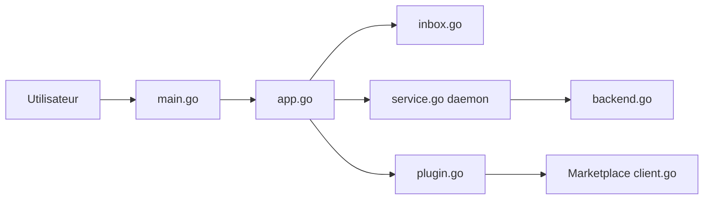

# floatpane/matcha

> Client e-mail en terminal, en Go et Bubble Tea, multi-comptes, avec plugins.

## Le problème
Lire et écrire du courrier depuis un terminal exige des clients vieillissants et peu extensibles.

## Ce que ça fait vraiment
Le README est court. Le code montre un client TUI avec recherche, vue des messages en HTML/Markdown, envoi, export, chiffrement, un daemon de boîte aux lettres, des fournisseurs JMAP, Maildir et POP3, et un système de plugins avec une place de marché (35+ plugins annoncés). Branche v1 en cours.

## Comment c'est branché


## Essayer
```bash
matcha marketplace
matcha install <url_or_file>
matcha config <plugin_name>
matcha --debug daemon status
```

## Coût et pièges
Gratuit. La v1 est en développement ; la v0 ne reçoit que des corrections. Aucune commande d'installation de base dans le README fourni.

## Ce que ce n'est pas
Pas un outil d'automatisation du courrier ni un service hébergé.

## Alternatives
Aucune alternative citée dans le README.

## Pour toi
À ignorer : client e-mail personnel, sans rapport avec data, IA ou MLOps.

