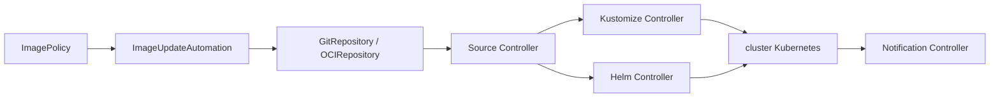

# fluxcd/flux2

> Outil GitOps qui garde des clusters Kubernetes synchronisés avec Git et des artefacts OCI.

## Le problème
Déployer par `kubectl apply` depuis un poste laisse le cluster diverger de ce qui est versionné, sans trace de qui a appliqué quoi.

## Ce que ça fait vraiment
Synchronise l'état du cluster avec des sources de configuration : dépôts Git, artefacts OCI, dépôts et charts Helm, buckets.
Automatise la mise à jour de la configuration quand un nouveau code est à déployer, y compris les mises à jour d'images vers Git.
Construit sur le GitOps Toolkit : des CRD et contrôleurs composables (Source, Kustomize, Helm, Notification, Image Automation).
Supporte le multi-tenant et un nombre arbitraire de dépôts Git synchronisés.

## Comment c'est branché

## Essayer
Aucune commande n'est documentée dans le README : il renvoie au guide de bootstrap sur fluxcd.io.

## Coût et pièges
Gratuit, projet CNCF gradué. Il faut donner à Flux un accès en écriture au dépôt Git pour l'automatisation d'images, et gérer les secrets — le README renvoie vers un guide SOPS pour ça.

## Ce que ce n'est pas
Pas un CI : il déploie ce qui est déjà construit et publié. Pas un outil unique mais un ensemble de contrôleurs, chacun avec ses CRD, qu'il faut comprendre séparément. Le README est un index, tout le contenu opérationnel est sur fluxcd.io.

## Alternatives
Aucune alternative nommée dans le README.

## Pour toi
Si tes modèles et services se déploient sur Kubernetes, Flux est la façon propre de versionner cet état.
