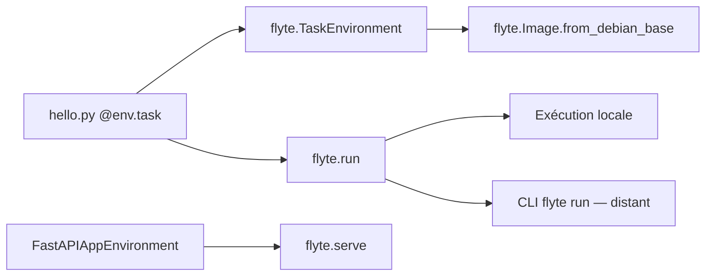

# flyteorg/flyte

> Orchestrateur de pipelines ML, de modèles et d'agents, écrit et piloté en Python pur.

## Le problème
Décrire un pipeline ML dans un DSL ou du YAML éloigne le code de la logique métier, et le passage
du local au cluster casse en général l'expérience de développement.

## Ce que ça fait vraiment
Un `TaskEnvironment` déclare un nom et une image ; le décorateur `@env.task` transforme une
fonction Python — synchrone ou `async` — en tâche orchestrée. Les tâches s'appellent entre elles
avec `.aio()` et se parallélisent par `asyncio.gather`. `flyte.run()` lance localement, la CLI
`flyte run` en distant. Un `FastAPIAppEnvironment` sert un modèle derrière FastAPI avec
`flyte.serve`. Une TUI donne une expérience locale enrichie.

## Comment c'est branché


## Essayer
```bash
uv pip install flyte
uv pip install flyte[tui]
python hello.py
flyte run hello.py main --numbers '[1,2,3]'
flyte serve serving.py env
```

## Coût et pièges
Le point majeur : **le back-end open source de Flyte 2 n'existe pas encore** — annoncé « coming
soon ». Aujourd'hui, un back-end de production prêt à l'emploi passe par Union.ai, commercial.
Flyte 1 reste maintenu, mais sur la branche `master`, ce qui rend la lecture du dépôt piégeuse.
Le SDK complet vit dans un autre dépôt, `flyte-sdk`.

## Ce que ce n'est pas
Ce n'est pas un ordonnanceur généraliste type cron. Ce dépôt n'est pas le SDK, et pas encore le
back-end : il contient surtout les définitions protobuf et le guide de contribution.

## Alternatives
- **Union.ai** : le back-end commercial, si tu as besoin de production immédiatement.
- **flyte-sdk** : le dépôt à installer si tu veux seulement le SDK et les outils de dev.

## Pour toi
À surveiller pour la version 2 ; n'y bascule pas un pipeline tant que le back-end libre manque.
