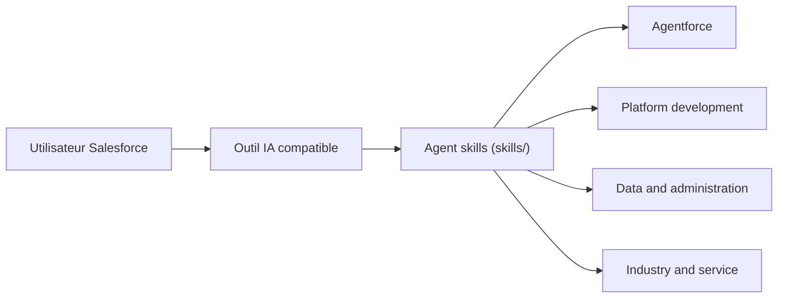

# forcedotcom/sf-skills

> Collection de skills d'agent pour développer sur Salesforce (Apex, Flow, LWC, Agentforce).

## Le problème
Un agent de code connaît mal les conventions Salesforce : Apex, SOQL, Flow, composants LWC, permissions.

## Ce que ça fait vraiment
Dépôt de dossiers « skill » (SKILL.md, scripts, références, assets) suivant la spécification Agent Skills. S'installe dans Claude Code, Codex, Cursor et d'autres, ou automatiquement dans Agentforce Vibes. Couvre Agentforce, plateforme, données et administration, industrie et service. Un dossier samples/ se synchronise depuis npm.

## Comment c'est branché


## Essayer
```bash
npx skills add forcedotcom/sf-skills
```

## Coût et pièges
Gratuit, mais utile seulement avec une org Salesforce. Le README prévient : skills renommés, restructurés ou supprimés d'une version à l'autre.

## Ce que ce n'est pas
Pas un SDK ni un outil autonome : des instructions pour un agent. Le détail des branches est plus large que ce que le code échantillonné montre.

## Alternatives
Aucune alternative nommée dans le README.

## Pour toi
À ignorer sauf si tu travailles sur Salesforce : sans cette plateforme, ces skills n'apportent rien à un profil data/IA/MLOps.

