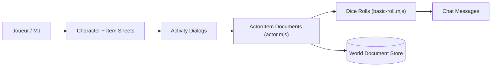

# foundryvtt/dnd5e

> Système de jeu D&D 5e pour Foundry Virtual Tabletop : fiches, dés, règles et contenu.

## Le problème
Jouer à D&D 5e sur une table virtuelle demande des fiches de personnage, des règles de dés et des compendiums intégrés.

## Ce que ça fait vraiment
Fournit fiches d'acteurs et d'objets, mécaniques de dés et de règles, avancement de classe, suivi de combat, navigateur de compendiums (monstres, héros, objets, sorts, aptitudes). D'après le code : documents acteurs/objets, activités, messages de chat, effets actifs, jets de dés et ciblage de jetons.

## Comment c'est branché

## Essayer
Coller l'URL dans la boîte « Install System » de Foundry : `https://raw.githubusercontent.com/foundryvtt/dnd5e/master/system.json`. Autre méthode : cloner dans `Data/systems/dnd5e`.

## Coût et pièges
Il faut Foundry VTT (logiciel commercial à licence) déjà installé. 921 issues ouvertes.

## Ce que ce n'est pas
Ce n'est pas un jeu autonome : c'est un module pour Foundry. Le README est court ; l'aide est dans le wiki.

## Alternatives
Le README ne cite aucune alternative.

## Pour toi
À ignorer : extension de jeu de rôle, sans usage pour un profil data/IA/MLOps.

