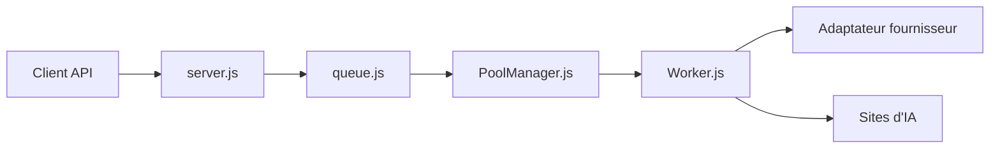

# foxhui/WebAI2API

> Transforme des sites web d'IA (LMArena, Gemini, ChatGPT…) en API compatible OpenAI par automatisation de navigateur.

## Le problème
Les modèles disponibles seulement via une interface web ne s'appellent pas depuis du code ni des outils qui parlent le format OpenAI.

## Ce que ça fait vraiment
Pilote un navigateur Camoufox (Playwright) qui imite frappe et mouvements de souris pour dialoguer avec les sites. Expose `/v1/chat/completions`, `/v1/models` et `/v1/cookies`, avec file de tâches, pool de workers, failover, flux avec keep-alive, multi-comptes isolés et interface web (logs, VNC). Texte, image et vidéo selon le site.

## Comment c'est branché


## Essayer
```bash
pnpm install
npm run init
npm start
docker run -d --name webai-2api -p 3000:3000 -v "$(pwd)/data:/app/data" --shm-size=2gb foxhui/webai-2api:latest
```

## Coût et pièges
Gratuit, mais un compte par site et une connexion manuelle initiale sont requis. L'interface web n'est pas chiffrée ; ressources : 2 Go de RAM recommandés. Risque de bannissement de compte, avec avertissement explicite de l'auteur.

## Ce que ce n'est pas
Pas une API officielle : les mécanismes d'imitation humaine visent à échapper à la détection, ce qui peut enfreindre les conditions des sites. Fragile aux changements d'interface.

## Alternatives
Aucune alternative nommée dans le README.

## Pour toi
À ignorer : contournement de détection et conditions d'usage violées, avec de faibles garanties ; utilise les API officielles des fournisseurs.

