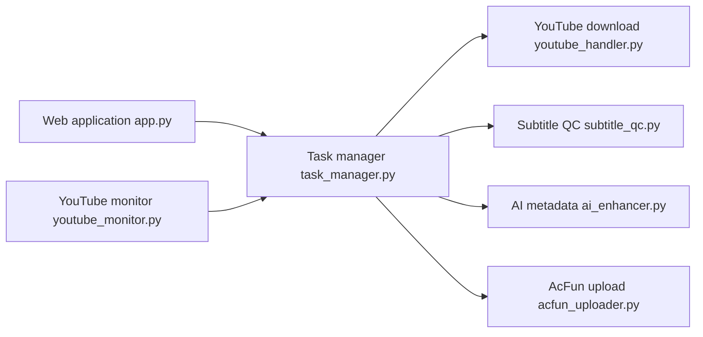

# fqscfqj/Y2A-Auto

> Outil automatisant le transfert de vidéos YouTube vers AcFun et bilibili, avec sous-titres et back-office web.

## Le problème
Republier des vidéos YouTube sur des plateformes chinoises demande téléchargement, sous-titres traduits, métadonnées et téléversement à la main.

## Ce que ça fait vraiment
Pipeline : yt-dlp, reconnaissance vocale (Whisper, Voxtral), traduction et contrôle qualité des sous-titres, incrustation, titre/description/tags par IA, modération (Aliyun), transcodage (CPU, NVIDIA, Intel, AMD), téléversement. Back-office Flask, surveillance de chaînes YouTube, notifications (WeChat Work, Server酱), CookieCloud.

## Comment c'est branché


## Essayer
```bash
docker compose up -d
docker compose -f docker-compose-build.yml up -d --build
```

## Coût et pièges
Cookies YouTube, AcFun et bilibili à fournir (ne pas les commiter). Clés OpenAI, YouTube Data API et Aliyun selon les modules. Mot de passe web désactivé par défaut : ne pas exposer le port 5000.

## Ce que ce n'est pas
Pas un outil neutre : republier des contenus soulève droits d'auteur et conditions des plateformes (le README demande un usage légal). Licence GPL-3.0.

## Alternatives
Aucune alternative nommée dans le README.

## Pour toi
À ignorer : niche (YouTube vers plateformes chinoises), copyleft et risques de conformité, sans rapport avec un profil data/IA.

