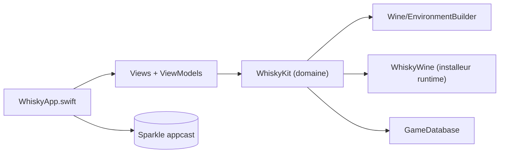

# frankea/Whisky

> Fork actif d'une interface SwiftUI pour Wine sur Mac Apple Silicon, afin de lancer des jeux Windows.

## Le problème
Faire tourner des applications et jeux Windows sur macOS via Wine exige configuration manuelle. L'original a été archivé en avril 2025.

## Ce que ça fait vraiment
Crée et gère des « bouteilles » Wine, installe un runtime Wine 11 (~330 Mo à la première exécution), traduit DirectX 11 vers Metal (DXMT) ou via DXVK/MoltenVK, et gère des lanceurs (Steam, Epic, etc.). Une base de jeux applique des réglages, un moteur de dépannage produit des rapports de diagnostic expurgés, et une commande d'import récupère les bouteilles de l'original.

## Comment c'est branché


## Essayer
```bash
brew install --cask frankea/whisky/whisky
brew uninstall --cask frankea/whisky/whisky
```

## Coût et pièges
Gratuit ; Apple Silicon et macOS 15 requis. Le cask Homebrew sans préfixe installe l'original archivé. Télémétrie PostHog optionnelle, désactivée par défaut.

## Ce que ce n'est pas
Ce n'est pas affilié à l'original ni à CrossOver. Le README avoue un seul mainteneur (facteur de bus faible) et recommande CrossOver pour un support commercial.

## Alternatives
- CrossOver (CodeWeavers) : Wine commercial et supporté.
- whisky-app/whisky : l'original, archivé.

## Pour toi
À ignorer : outil de jeu sur Mac, sans rapport avec la data/l'IA/le MLOps.

