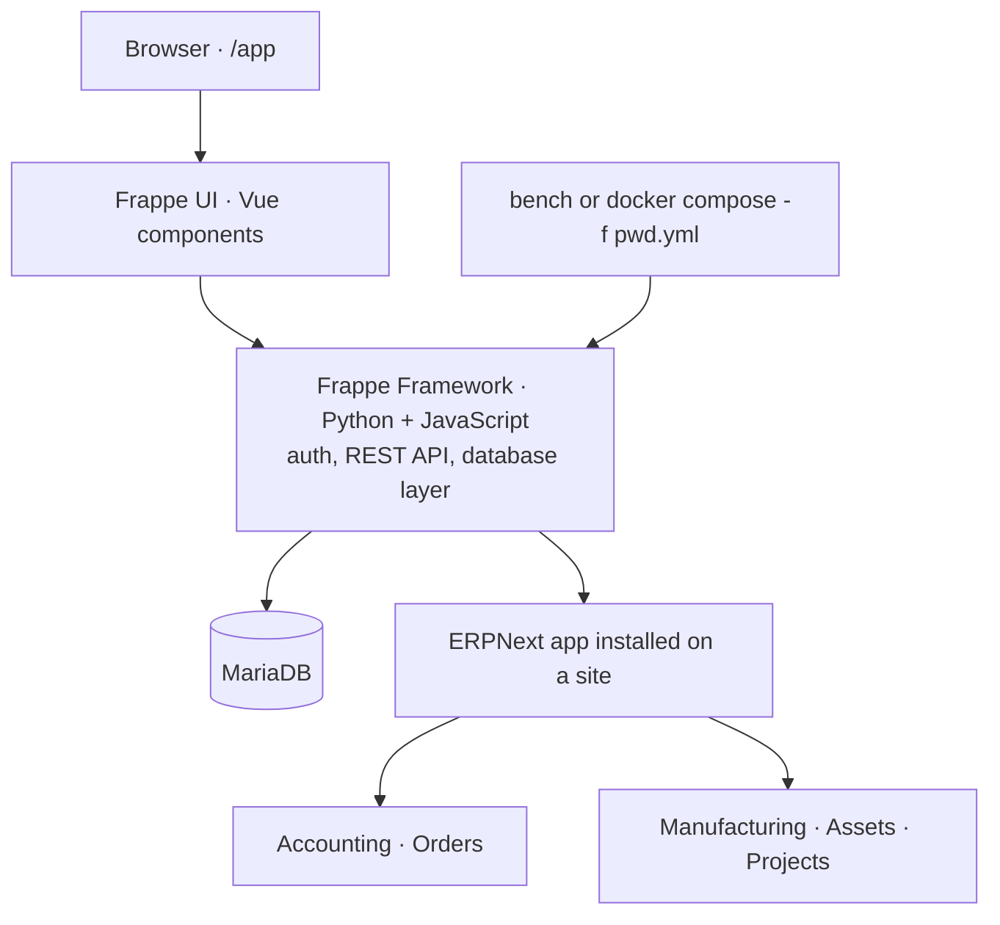

# frappe/erpnext

> **A full open-source ERP written in Python, self-hosted, to run a whole small business.**

## The problem

Without it, every business function is bought separately: one package for invoicing, another
for stock, a third for payroll, and none of them share a database. The README starts exactly
there: handling invoices, stock, personnel and daily operations is a complex job, and the
market sells each piece on its own.

## What it actually does

ERPNext is a business **application**, not a technical building block. The modules it claims:

- **Accounting**: from recording transactions to summarizing and analyzing financial reports.
- **Order management**: stock levels, replenishment, sales orders, customers, suppliers,
  shipments, deliverables, order fulfillment.
- **Manufacturing**: production cycle, material consumption, capacity planning, subcontracting.
- **Asset management**: purchase to disposal, IT infrastructure as well as equipment.
- **Projects**: tasks, timesheets and issues tracked per project, with budget and profitability.

The repository itself provides none of the plumbing: the database layer, user authentication
and the REST API all come from the **Frappe Framework**, on top of which ERPNext is merely an
installed app, with **Frappe UI** (Vue components) for the interface.

## How it is wired



No code-derived diagram exists for this repository, so the graph only restates what the
README describes: the framework dependency, the Vue UI layer, the functional modules and the
two installation paths.

## Try it

The README offers a disposable evaluation through the Docker repository — it warns that the
environment is meant to be thrown away and that custom apps cannot be installed on it:

```sh
git clone https://github.com/frappe/frappe_docker
cd frappe_docker
docker compose -f pwd.yml up -d
```

Wait a couple of minutes, then open port `8080` (`Administrator` / `admin`).

For a development machine, once bench is installed:

```
bench start
bench new-site erpnext.localhost
bench get-app https://github.com/frappe/erpnext
bench --site erpnext.localhost install-app erpnext
```

Then `http://erpnext.localhost:8000/app`.

## Cost and traps

The software is free and GPL-3.0 — **copyleft**, which matters if you plan to graft code onto
it that you would rather not publish. No API key, no GPU. The real cost sits elsewhere: you
need Docker, Docker Compose v2 and git, a MariaDB database, and the README defers production
configuration to external documentation rather than describing it. The manual install script
generates passwords and writes them to `~/frappe_passwords.txt`. Managed hosting on Frappe
Cloud is a paid service and requires an account.

## What it is not

- **Not a Python library you import.** It is an app installed on a Frappe site; outside the
  framework it does not exist.
- **The Docker demo is not a deployment.** The README says plainly that it is for quick
  evaluation and that custom apps are out of reach there.
- **Not a data project.** It produces management data, it does not analyze it: no ML piece,
  no warehouse, no analytical connector documented here.

## Alternatives

- **frappe/frappe** — when you want the platform (database layer, auth, REST API) to build
  your own business app, without the ERP modules.
- **frappe/hrms** — when only the HR side is of interest, rather than the whole ERP.
- **frappe/press** — the hosting platform behind Frappe Cloud, to administer several Frappe
  deployments yourself.

The other catalogue neighbours (PythonRobotics, jsdoc, prism) are not comparable.

## For you

Of no use as a data / AI / MLOps tool: this is business management software. The one useful
angle is as a **data source** — an open-source ERP whose schema and REST API are reachable
makes an honest playground for reporting or forecasting work. Worth knowing, not adopting.
