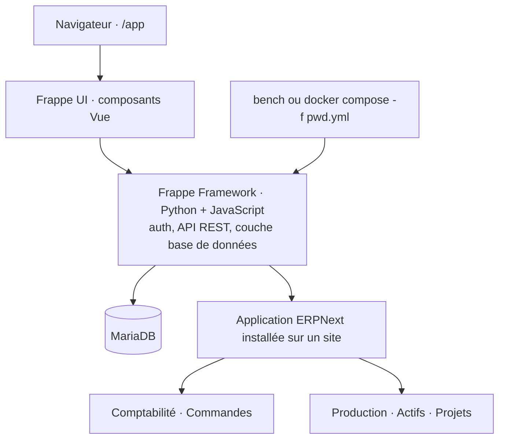

# frappe/erpnext

> **Un ERP complet en Python, à installer chez soi, pour faire tourner une PME entière.**

## Le problème

Sans lui, chaque fonction de l'entreprise s'achète séparément : un logiciel de facturation,
un autre pour le stock, un troisième pour la paie, et personne ne partage la même base.
Le README part exactement de là : gérer factures, stock, personnel et opérations quotidiennes
est une tâche complexe, et le marché vend chaque morceau à part.

## Ce que ça fait vraiment

ERPNext est une **application métier**, pas une brique technique. Les modules annoncés :

- **Comptabilité** : saisie des écritures jusqu'aux états financiers.
- **Gestion des commandes** : niveaux de stock, réapprovisionnement, commandes clients,
  clients, fournisseurs, expéditions, livrables.
- **Production** : cycle de fabrication, consommation matière, planification de capacité,
  sous-traitance.
- **Actifs** : de l'achat à la mise au rebut, infrastructure IT comme équipements.
- **Projets** : tâches, feuilles de temps et incidents rattachés à un projet, avec budget.

Le code lui-même ne fait ni la base de données, ni l'authentification, ni l'API : tout cela
vient du **Frappe Framework**, sur lequel ERPNext n'est qu'une application installée.

## Comment c'est branché



Aucun diagramme tiré du code n'existe pour ce dépôt : ce schéma ne reprend que ce que le
README décrit — la dépendance au framework, la couche UI Vue, les modules fonctionnels et
les deux chemins d'installation.

## Essayer

Le README propose une évaluation jetable via le dépôt Docker (il prévient lui-même que
l'environnement est à jeter et qu'on ne peut pas y installer d'applications custom) :

```sh
git clone https://github.com/frappe/frappe_docker
cd frappe_docker
docker compose -f pwd.yml up -d
```

Attendre quelques minutes, puis le port `8080` (`Administrator` / `admin`).

Pour un poste de développement, après avoir installé bench :

```
bench start
bench new-site erpnext.localhost
bench get-app https://github.com/frappe/erpnext
bench --site erpnext.localhost install-app erpnext
```

Puis `http://erpnext.localhost:8000/app`.

## Coût et pièges

Le logiciel est gratuit et sous GPL-3.0 — **copyleft** : à surveiller si tu envisages d'y
greffer du code que tu ne veux pas publier. Aucune clé d'API, aucun GPU. Le vrai coût est
ailleurs : il faut Docker, Docker Compose v2 et git, une base MariaDB, et le README renvoie
la configuration de production à la documentation externe plutôt que de la décrire. Le
script d'installation manuel fabrique des mots de passe qu'il écrit dans
`~/frappe_passwords.txt`. L'hébergement géré Frappe Cloud est payant et suppose un compte.

## Ce que ce n'est pas

- **Pas une bibliothèque Python à importer.** C'est une application qui s'installe sur un
  site Frappe ; en dehors du framework, elle n'existe pas.
- **La démo Docker n'est pas un déploiement.** Le README dit noir sur blanc qu'elle sert à
  évaluer et qu'on la jette — pas d'applications custom dessus.
- **Ce n'est pas un projet data.** Il produit des données de gestion, il ne les analyse pas :
  aucune brique ML, aucun entrepôt, aucun connecteur analytique documenté ici.

## Alternatives

- **frappe/frappe** — si tu veux la plateforme (base, auth, API REST) pour bâtir ta propre
  application métier, sans les modules ERP.
- **frappe/hrms** — si seul le volet ressources humaines t'intéresse, plutôt que l'ERP entier.
- **frappe/press** — la plateforme d'hébergement derrière Frappe Cloud, si tu veux
  administrer plusieurs déploiements Frappe toi-même.

Les autres voisins du catalogue (PythonRobotics, jsdoc, prism) ne sont pas comparables.

## Pour toi

Aucun intérêt comme outil de travail data / IA / MLOps : c'est un progiciel de gestion.
Le seul angle utile est celui de la **source de données** — un ERP open source dont le
schéma et l'API REST sont accessibles fait un terrain d'essai honnête pour du reporting ou
de la prévision. À connaître, pas à adopter.
