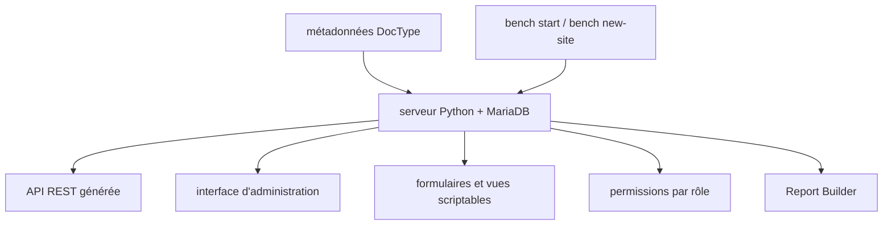

# frappe/frappe

> Cadre web full-stack Python/MariaDB piloté par métadonnées, conçu pour des applications métier vastes.

## Le problème
Les applications métier se construisent autour de l'interface, pas de la sémantique des objets manipulés, et deviennent incohérentes.
Chaque nouvel objet impose de réécrire formulaires, permissions, API et rapports.

## Ce que ça fait vraiment
Définit les objets par métadonnées : l'interface d'administration, les permissions par rôle et l'API REST sont générées pour tous les modèles.
Python et MariaDB côté serveur, bibliothèque cliente intégrée côté navigateur ; formulaires et vues personnalisables par script serveur et JavaScript client.
Un Report Builder permet de créer des rapports sans écrire de code.
Première application construite dessus : ERPNext, avec plus de 700 types d'objets.

## Comment c'est branché


## Essayer
```
git clone https://github.com/frappe/frappe_docker
cd frappe_docker
docker compose -f pwd.yml up -d
bench start
bench new-site frappe.localhost
```

## Coût et pièges
Gratuit en auto-hébergement ; Frappe Cloud est l'offre gérée payante du même éditeur.
Le compte par défaut de l'image Docker est `Administrator` / `admin` : à changer avant toute exposition. Le script d'installation manuelle génère et écrit des mots de passe dans `~/frappe_passwords.txt`.

## Ce que ce n'est pas
Pas un cadre pour débuter : le README dit qu'il n'est pas « pour les cœurs légers » et déconseille de l'apprendre en premier.
Pas ERPNext : c'est la couche en dessous, ERPNext en est l'application phare.
Pas agnostique de base de données : MariaDB est posé d'emblée.

## Alternatives
- frappe/bench : l'outil d'installation et d'exploitation, complément et non substitut.
- frappe/frappe_docker : la voie Docker, y compris ARM.

## Pour toi
Hors périmètre data/IA : à ignorer sauf si tu dois reprendre une application ERPNext.
