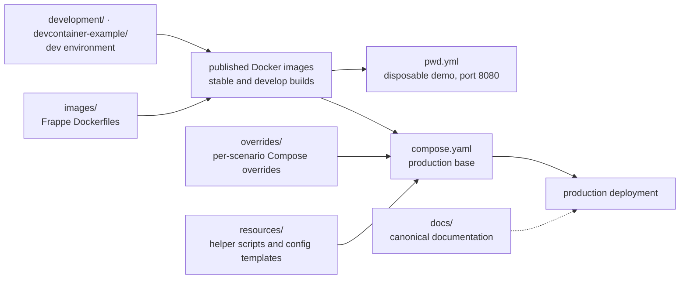

# frappe/frappe_docker

> **The official Docker images and Compose files for running ERPNext and other Frappe apps in containers.**

## The problem

Installing a Frappe application by hand means assembling the web server, database, cache,
queues and scheduler yourself, then rebuilding that same stack for development, staging and
production. Every drift between the three shows up later as an incident nobody can reproduce.

## What it actually does

The repository ships three things and no more: `Dockerfile`s under `images/` to build the
Frappe images, a base `compose.yaml` for production setups, and a set of Compose overrides in
`overrides/` matching common deployment patterns.

Alongside them, `pwd.yml` is a single Compose file that brings up a disposable ERPNext demo.
The README is explicit: custom apps cannot be installed on it, and it is meant for short-lived
evaluation only.

Everything else — choosing a deployment method, ARM64 notes, running in production, day-two
operations, development environments (`development/`, `devcontainer-example/`) — lives in
`docs/`, published at `frappe.github.io/frappe_docker`. The README documents none of those
procedures itself; it is an index.

Scope is deliberately limited to containers. For application code the README points at
`frappe/frappe`, `frappe/erpnext` and `frappe/bench`.

## How it is wired

No code-derived diagram exists for this repository: the graph below is reconstructed from the
README's "Repository Structure" section alone.



## Trying it

```bash
git clone https://github.com/frappe/frappe_docker
cd frappe_docker
```

```bash
docker compose -f pwd.yml up -d
```

The README says to wait a couple of minutes for the ERPNext site to be created, or watch the
`create-site` container logs, then open a browser on port `8080` (username `Administrator`,
password `admin`). No production command appears in the README; it defers to
`docs/03-production/`.

## Cost and gotchas

- **Prerequisites**: Docker, Docker Compose v2 and git. Nothing else is required by the
  README — no API key, no account to create, no GPU.
- **No sizing figures**: the README gives no RAM, disk or CPU guidance for the full stack
  (web, database, cache, queues, scheduler). You measure it yourself.
- **The demo is not a starting point**: `pwd.yml` is labelled disposable-only and refuses
  custom apps. Migrating from it to production is not a path the README describes.
- **ARM64 has its own docs page**, which suggests the topic is not neutral across machines.
- **The real cost is elsewhere**: operating ERPNext (backups, upgrades, multiple sites) is the
  weight, not this repository.

## What it is not

- **It is not ERPNext or the Frappe framework.** No application code lives here — only images,
  Compose files and docs. The README states this and redirects non-container contributions.
- **It is not a Helm chart or a Kubernetes operator**: the README only covers Docker Compose.
  Anything beyond that orchestrator is outside the declared scope.
- **It is not a self-contained README**: the operational content sits in `docs/` and the wiki.
  Read on its own, this page will not get you to production — hence the flag on the sheet.

## Alternatives

| | When to prefer it |
|---|---|
| **frappe/bench** | Named in the README: the native installer and site manager for Frappe, no containers. Prefer it when you want control of the host; prefer `frappe_docker` when you need the same stack reproduced across environments. |
| **psviderski/uncloud** | Catalogue neighbour: generic container deployment across arbitrary machines. Prefer it when tooling a fleet of applications; here you only want one pre-wired stack. |
| **ToolJet/ToolJet** | Catalogue neighbour, comparable only in end use (self-hosted business app): prefer it to build bespoke internal tools, not to deploy an existing ERP. |

`gogs/gogs` and `TwiN/gatus` are not comparable: a git forge and an uptime monitor.

## For you

Little direct value for a data or AI profile: this packages an ERP, not model tooling. The
value is indirect but real — it is the quickest way to stand up a throwaway ERPNext instance
when you need to explore a business data schema, wire a connector or prototype an extraction
flow without negotiating access to production. Keep it in reach; do not adopt it as a building
block.
