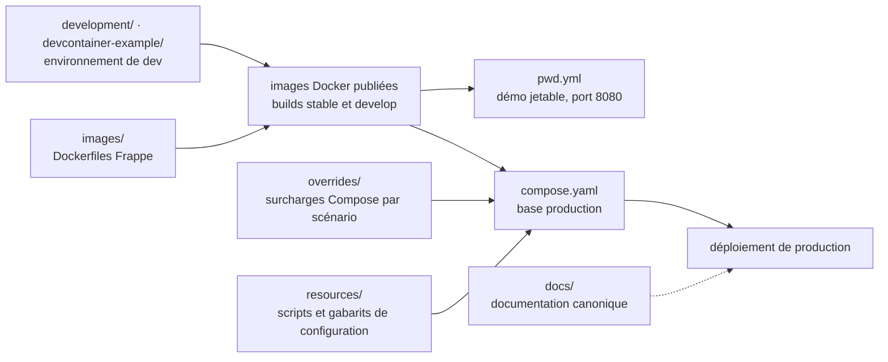

# frappe/frappe_docker

> **Le dépôt officiel d'images et de fichiers Compose pour faire tourner ERPNext et les applications Frappe en conteneurs.**

## Le problème

Installer une application Frappe à la main suppose d'assembler soi-même le serveur web, la
base de données, le cache, les files d'attente et les tâches planifiées, puis de refaire ce
montage à l'identique en développement, en préproduction et en production. Chaque écart entre
les trois se paie en incidents que personne ne sait reproduire.

## Ce que ça fait vraiment

Le dépôt fournit trois choses et pas davantage : des `Dockerfile` (`images/`) pour construire
les images Frappe, un `compose.yaml` de base pour les déploiements de production, et un jeu de
surcharges Compose (`overrides/`) correspondant aux scénarios de déploiement courants.

À côté, `pwd.yml` est un fichier Compose unique qui monte une démonstration ERPNext jetable :
le README précise qu'on ne peut **pas** y installer d'applications personnalisées et qu'elle
est réservée à une évaluation de courte durée.

Le reste — choix d'une méthode de déploiement, notes ARM64, mise en production, exploitation,
environnements de développement (`development/`, `devcontainer-example/`) — est documenté dans
`docs/`, publié sur `frappe.github.io/frappe_docker`. Le README lui-même ne détaille aucune de
ces procédures : il sert d'index.

Le périmètre est explicitement limité au conteneur. Le README renvoie vers `frappe/frappe`,
`frappe/erpnext` et `frappe/bench` pour tout ce qui relève du code applicatif.

## Comment c'est branché

Aucun diagramme tiré du code n'existe pour ce dépôt : ce schéma est reconstruit depuis la
section « Repository Structure » du seul README.



## Essayer

```bash
git clone https://github.com/frappe/frappe_docker
cd frappe_docker
```

```bash
docker compose -f pwd.yml up -d
```

Le README indique d'attendre quelques minutes que le site ERPNext soit créé, ou de surveiller
les journaux du conteneur `create-site`, puis d'ouvrir le navigateur sur le port `8080`
(identifiant `Administrator`, mot de passe `admin`). Aucune commande de mise en production
n'est donnée dans le README : elle est renvoyée à `docs/03-production/`.

## Coût et pièges

- **Prérequis** : Docker, Docker Compose v2 et git. Rien d'autre n'est exigé par le README ;
  aucune clé d'API, aucun compte à créer, aucun GPU.
- **Aucun chiffre de dimensionnement** : le README n'indique ni RAM, ni disque, ni CPU pour la
  pile complète (web, base de données, cache, files d'attente, planificateur). C'est à
  éprouver soi-même.
- **La démo n'est pas une base de départ** : `pwd.yml` est marqué « disposable demo only »,
  sans installation d'applications personnalisées. Migrer de la démo vers la production n'est
  pas un chemin documenté dans le README.
- **ARM64 fait l'objet d'une page dédiée** dans `docs/`, signe que le sujet n'est pas neutre
  selon la machine.
- **Le vrai coût est ailleurs** : c'est l'exploitation d'ERPNext (sauvegardes, montées de
  version, sites multiples) qui pèse, pas le dépôt lui-même.

## Ce que ce n'est pas

- **Ce n'est pas ERPNext ni le framework Frappe.** Le dépôt ne contient aucun code applicatif :
  seulement des images, des fichiers Compose et de la documentation. Le README l'écrit et
  renvoie ailleurs les contributions qui ne concernent pas le conteneur.
- **Ce n'est pas un Helm chart ni un opérateur Kubernetes** : le README ne parle que de Docker
  Compose. Tout orchestrateur au-delà est hors périmètre annoncé.
- **Ce n'est pas un README autoportant** : l'essentiel du contenu opérationnel vit dans `docs/`
  et le wiki. Lue seule, cette page ne permet pas de déployer en production — d'où l'alerte.

## Alternatives

| | Quand le préférer |
|---|---|
| **frappe/bench** | Nommé dans le README : l'outil d'installation et de gestion native des sites Frappe, sans conteneur. À préférer quand on veut la main sur l'hôte et un `bench` classique ; `frappe_docker` à préférer pour reproduire à l'identique d'un environnement à l'autre. |
| **psviderski/uncloud** | Voisin du catalogue : déploiement de conteneurs sur des machines quelconques, générique. À préférer quand le besoin est d'outiller un parc d'applications ; ici on ne veut qu'une seule pile applicative, déjà câblée. |
| **ToolJet/ToolJet** | Voisin du catalogue, comparable seulement par l'usage final (application métier auto-hébergée) : à préférer pour construire des outils internes sur mesure, et non pour déployer un ERP existant. |

`gogs/gogs` et `TwiN/gatus` ne sont pas comparables : forge git et supervision de disponibilité.

## Pour toi

Peu de valeur directe pour un profil data / IA : c'est de l'emballage d'un ERP, pas de
l'outillage de modèles. L'intérêt est indirect et réel — c'est la façon la plus rapide de se
monter une instance ERPNext jetable quand on doit explorer un schéma de données métier,
brancher un connecteur ou prototyper un flux d'extraction, sans négocier un accès à la
production. À garder sous le coude, pas à adopter comme brique.
