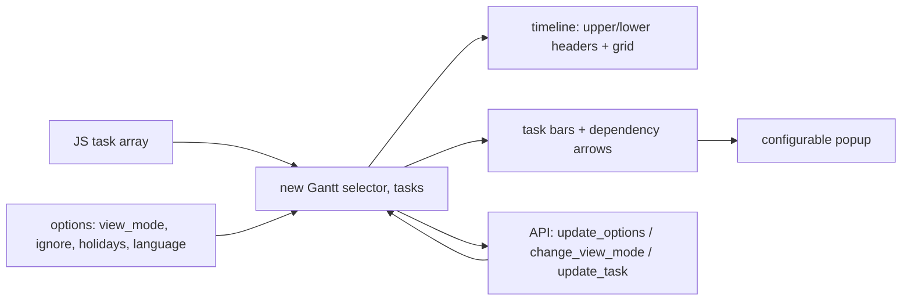

# frappe/gantt

> **One sentence.** A configurable JavaScript Gantt chart library for the web, used by ERPNext.

## The problem

Showing a project schedule — tasks, dates, progress, dependencies — inside a web page
otherwise means hand-drawing bars and arrows in SVG, or paying for a proprietary widget. The
authors say they wanted a Gantt view for ERPNext and could not find an open source one.

## What it actually does

Renders a Gantt chart into a DOM container from an array of tasks (`id`, `name`, `start`,
`end`, `progress`). Ships Day / Week / Month / Year views and lets you define your own through
`view_modes` (name, step, upper and lower header formats, upper text frequency, thick lines).
Periods can be excluded from rendering and from progress calculation via `ignore`, `holidays`
and `is_weekend`. Bars can be dragged and resized, with `snap_at` as the snapping interval,
and `move_dependencies` shifts linked tasks along. The popup is a function receiving the task
and the chart; it may return `false`, return an HTML string, or manipulate the `title`,
`subtitle` and `details` sections and add actions. Localization is set with `language`
(ISO 639-1 codes). The API exposes `.update_options`, `.change_view_mode`, `.scroll_current`
and `.update_task`.

## How it is wired



Rendering targets an element given by a selector (`#gantt`); `frappe-gantt.css` carries the
styles and the `frappe-gantt.umd.js` bundle the code.

## Trying it

```bash
npm install frappe-gantt
```

```html
<script src="https://cdn.jsdelivr.net/npm/frappe-gantt/dist/frappe-gantt.umd.js"></script>
<link
    rel="stylesheet"
    href="https://cdn.jsdelivr.net/npm/frappe-gantt/dist/frappe-gantt.css"
/>
```

```js
let gantt = new Gantt("#gantt", tasks);

// Use .refresh to update the chart
gantt.tasks.append(...)
gantt.tasks.refresh()
```

To contribute: clone the repo, `cd` into it, run `pnpm i`, then `pnpm run build` (or
`pnpm run build-dev` to watch for changes) and open `index.html` in a browser.

## Cost and gotchas

Nothing to pay, no API key, no third-party service — it runs in the browser. Node (and pnpm
for development) is needed for the npm install; the jsDelivr CDN path needs no build chain at
all. Gotcha: the stylesheet is a separate file from the JS, and forgetting it gives an
unstyled chart. Also note `infinite_padding` defaults to `true`, so the timeline keeps
extending as you scroll. The README documents neither a license, nor a versioning policy, nor
browser compatibility.

## What it is not

It is not a project management tool: no storage, no server, no task persistence — the host
application must supply and save the task array. It is not a scheduling engine either: no
critical path, workload or resource computation is documented, and `move_dependencies` only
shifts linked tasks. And it is not an official React/Vue component: the documented usage is a
JS constructor over a DOM selector.

## Alternatives

The README names Google Gantt and DHTMLX as early design inspirations, not as substitutes,
and neither is a catalogue repository. From the catalogue side, no comparable alternative is
available for this repository.

## Why it matters to you

Limited overlap with a data / MLOps routine, unless you are building a web dashboard where a
schedule of jobs, runs or campaigns should read as time bars: it is then a light front-end
dependency with no backend and no account to create. Otherwise, skip it.
