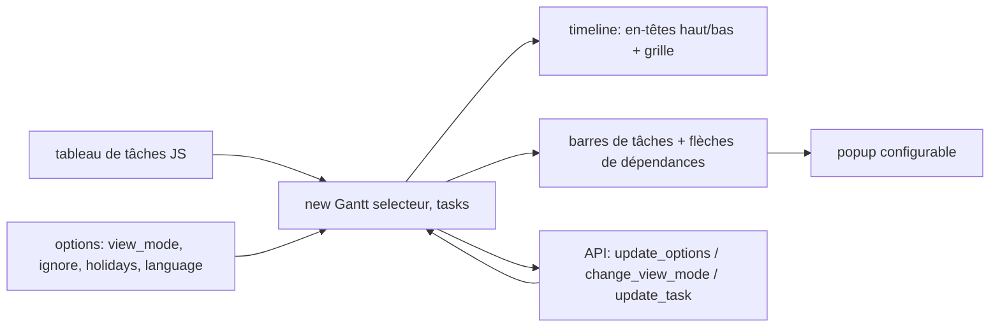

# frappe/gantt

> **Une phrase.** Bibliothèque JavaScript de diagrammes de Gantt pour le web, configurable, utilisée par ERPNext.

## Le problème

Afficher un planning de tâches avec dates, avancement et dépendances dans une page web suppose
sinon de dessiner soi-même des barres et des flèches en SVG, soit de passer par une solution
propriétaire. Les auteurs écrivent qu'ils cherchaient une vue Gantt open source pour ERPNext
et n'en ont pas trouvé.

## Ce que ça fait vraiment

Rend un diagramme de Gantt à partir d'un tableau de tâches (`id`, `name`, `start`, `end`,
`progress`) dans un conteneur du DOM. Gère les vues Day / Week / Month / Year, et permet de
définir ses propres vues via `view_modes` (nom, pas, formats des en-têtes haut et bas,
fréquence du texte supérieur, lignes épaisses). Permet d'exclure des périodes (`ignore`,
`holidays`, `is_weekend`) du calcul d'avancement et du rendu. Le déplacement et le
redimensionnement des barres sont éditables, avec `snap_at` comme pas d'accroche, et
`move_dependencies` déplace les tâches liées. Le popup est une fonction qui reçoit la tâche et
le graphique et peut renvoyer `false`, du HTML, ou manipuler les sections `title`, `subtitle`,
`details` et ajouter des actions. La localisation passe par l'option `language` (codes
ISO 639-1). L'API expose `.update_options`, `.change_view_mode`, `.scroll_current` et
`.update_task`.

## Comment c'est branché



Le rendu se fait dans un élément désigné par un sélecteur (`#gantt`) ; la feuille
`frappe-gantt.css` porte les styles, le bundle `frappe-gantt.umd.js` le code.

## Essayer

```bash
npm install frappe-gantt
```

```html
<script src="https://cdn.jsdelivr.net/npm/frappe-gantt/dist/frappe-gantt.umd.js"></script>
<link
    rel="stylesheet"
    href="https://cdn.jsdelivr.net/npm/frappe-gantt/dist/frappe-gantt.css"
/>
```

```js
let gantt = new Gantt("#gantt", tasks);

// Use .refresh to update the chart
gantt.tasks.append(...)
gantt.tasks.refresh()
```

Pour contribuer : cloner, `cd` dans le dossier, `pnpm i`, puis `pnpm run build` (ou
`pnpm run build-dev` pour surveiller les changements), et ouvrir `index.html` dans le
navigateur.

## Coût et pièges

Rien à payer, pas de clé d'API, pas de service tiers : le code tourne dans le navigateur.
Il faut Node (ou pnpm côté développement) pour l'installation par npm, sinon le CDN jsDelivr
suffit et n'impose aucune chaîne de build. Piège : la feuille CSS est un fichier séparé du
JS — l'oublier donne un graphique sans style. Autre point d'attention, `infinite_padding`
est à `true` par défaut, donc la timeline s'étend à mesure qu'on scrolle. Le README ne
documente ni licence, ni politique de versions, ni compatibilité navigateur.

## Ce que ce n'est pas

Ce n'est pas un outil de gestion de projet : pas de stockage, pas de serveur, pas de
persistance des tâches — c'est à l'application hôte de fournir et sauvegarder le tableau de
tâches. Ce n'est pas non plus un moteur de planification : aucun calcul de chemin critique,
de charge ou de ressources n'est documenté ; `move_dependencies` se contente de décaler les
tâches liées. Enfin ce n'est pas un composant React/Vue officiel : l'usage documenté est un
constructeur JS sur un sélecteur DOM.

## Alternatives

Le README cite comme inspirations initiales Google Gantt et DHTMLX, sans les présenter comme
des projets de remplacement, et ce ne sont pas des dépôts du catalogue. Côté catalogue, aucune
alternative comparable dans le catalogue n'est fournie pour ce dépôt.

## Pour toi

Peu de recouvrement avec un quotidien data / MLOps, sauf si tu construis un tableau de bord
web où un planning de jobs, de runs ou de campagnes doit se lire en barres temporelles :
c'est alors une dépendance front légère, sans backend et sans compte à créer. Sinon, passe
ton chemin.
