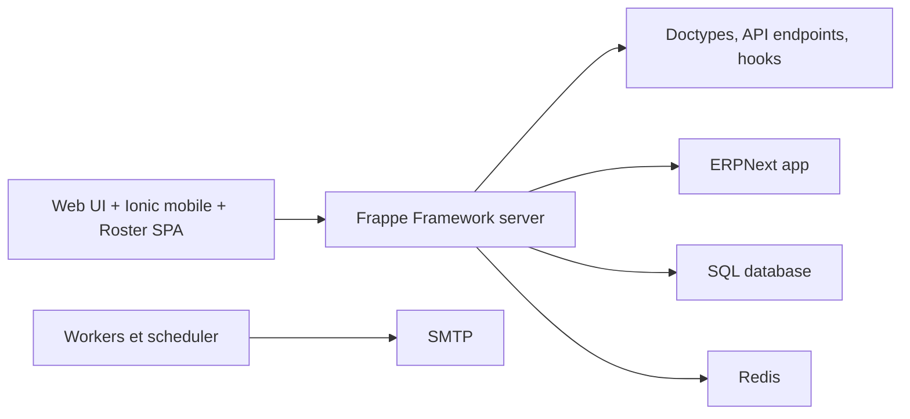

# frappe/hrms

> Frappe HR : logiciel libre de ressources humaines et de paie, construit sur le framework Frappe.

## Le problème
Gérer employés, congés, notes de frais et paie sans logiciel RH propriétaire.

## Ce que ça fait vraiment
Plus de treize modules : cycle de vie de l'employé, congés et présence (pointage géolocalisé), notes de frais avec workflows d'approbation, évaluation de la performance, paie et fiscalité, application mobile. Il s'appuie sur Frappe Framework (Python/JS) et Frappe UI (Vue). Il se couple à ERPNext, séparé depuis la version 14. L'architecture décrite d'après le code ajoute une SPA de planning, MariaDB, Redis et des workers.

## Comment c'est branché


## Essayer
```bash
git clone https://github.com/frappe/hrms
cd hrms/docker
docker-compose up
```
Le site répond sur http://localhost:8000 (identifiants de développement : Administrator / admin).

## Coût et pièges
Gratuit en auto-hébergement ; Frappe Cloud est proposé en hébergement géré. Ne pas garder les identifiants par défaut hors d'un poste de test. 479 issues ouvertes.

## Ce que ce n'est pas
Ce n'est pas un module de reporting RH ni un outil d'analyse : c'est une application transactionnelle de gestion.

## Alternatives
Le README cite ERPNext, dont HRMS est issu, comme socle couplé plutôt que comme rival.

## Pour toi
Ignorer : logiciel RH sans rapport avec le travail data/IA, sous GPL-3.0 ; à considérer seulement si ton entreprise cherche un HRMS libre.

