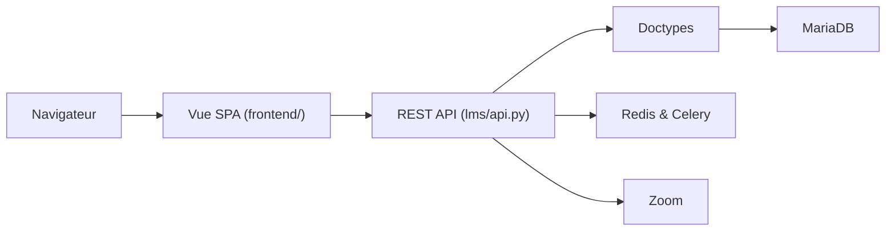

# frappe/lms

> Plateforme d'apprentissage en ligne open source pour créer des cours, des quiz et des certificats.

## Le problème
Les LMS classiques comme Moodle ont des formulaires longs et une interface confuse pour publier un cours.

## Ce que ça fait vraiment
Un cours se compose de chapitres et de leçons. On peut ajouter des quiz, des devoirs, des lots d'apprenants avec des classes Zoom et des certificats. Le serveur repose sur le framework Frappe (Python, MariaDB, Redis), le front est une application Vue avec Frappe UI.

## Comment c'est branché


## Essayer
```bash
wget https://frappe.io/easy-install.py
python3 ./easy-install.py deploy \
    --project=learning_prod_setup \
    --email=your_email.example.com \
    --image=ghcr.io/frappe/lms \
    --version=stable \
    --app=lms \
    --sitename subdomain.domain.tld
```

## Coût et pièges
Auto-hébergement gratuit, ou Frappe Cloud en option. Zoom est nécessaire pour les classes en direct. Licence AGPL-3.0.

## Ce que ce n'est pas
Pas un outil d'entraînement de modèles. Ce n'est pas un service géré par défaut.

## Alternatives
- Moodle : cité comme point de départ, écarté par l'auteur pour son interface.

## Pour toi
À ignorer pour ton métier : utile seulement si tu dois monter une plateforme de formation interne.

