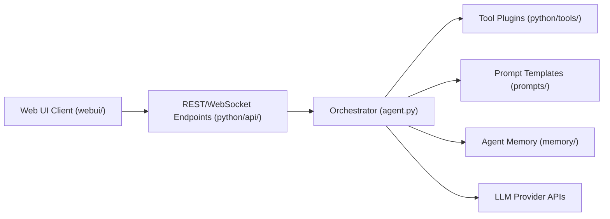

# frdel/agent-zero

> Framework d'agent open source qui donne à l'IA un bureau Linux Dockerisé, un navigateur et des documents partagés.

## Le problème
Un agent limité au chat ne peut ni utiliser d'applications graphiques ni éditer des fichiers avec toi en direct.

## Ce que ça fait vraiment
Lance dans Docker un bureau Linux XFCE, un navigateur avec annotation du DOM, et des éditeurs Markdown et LibreOffice partagés. L'agent utilise projets isolés (mémoire, secrets, dépôts), skills, profils d'agent, presets de modèles, sous-agents, plugins, MCP et A2A. Un connecteur CLI `a0` étend l'agent à ta machine hôte. Time Travel garde l'historique des espaces de travail. Connexion possible à un plan OpenAI Codex.

## Comment c'est branché


## Essayer
```bash
docker run -p 80:80 -v a0_usr:/a0/usr agent0ai/agent-zero
curl -fsSL https://bash.agent-zero.ai | bash
curl -LsSf https://cli.agent-zero.ai/install.sh | sh
```

## Coût et pièges
Les appels LLM sont à ta charge (clé du fournisseur choisi). Le README recommande de rester dans Docker et de ne pas monter tout le répertoire personnel ; accorder l'accès en écriture et l'exécution de code via `a0` seulement pour des machines de confiance. Les installateurs sont des `curl | bash`.

## Ce que ce n'est pas
Ce n'est pas sûr par défaut : l'agent exécute du code réel dans un environnement complet. Ce n'est pas un simple assistant de chat.

## Alternatives
Aucune alternative nommée dans le README.

## Pour toi
Surveiller : intéressant pour expérimenter des agents avec bureau complet en bac à sable, mais exigeant en confiance et sans licence identifiée.
