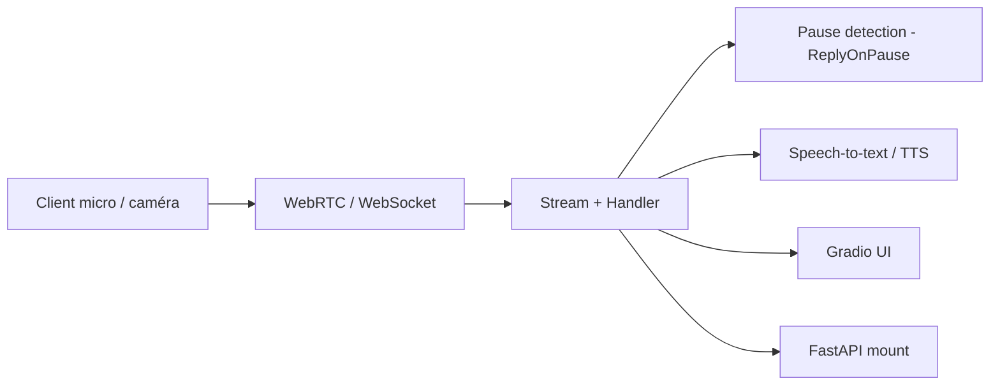

# freddyaboulton/fastrtc

> Bibliothèque Python qui transforme une fonction en flux audio ou vidéo temps réel via WebRTC ou WebSocket.

## Le problème
Brancher un modèle à un micro ou une caméra en temps réel oblige à gérer WebRTC, détection de pauses et interface.

## Ce que ça fait vraiment
On écrit un gestionnaire (par exemple `ReplyOnPause`) qui reçoit l'audio jusqu'à la pause de l'utilisateur et produit une réponse. Le `Stream` peut se lancer avec une interface Gradio (`.ui.launch()`), se monter sur FastAPI (`.mount(app)`) pour WebRTC ou WebSocket, ou obtenir un numéro de téléphone temporaire (`fastphone()`, jeton Hugging Face requis). Extras `vad` et `tts`. Le cookbook montre Gemini, OpenAI, Claude, Whisper, YOLOv10.

## Comment c'est branché


## Essayer
```bash
pip install fastrtc
pip install "fastrtc[vad, tts]"
```
```python
stream.ui.launch()
```

## Coût et pièges
Gratuit ; les exemples appellent des services payants (Groq, Anthropic, ElevenLabs). Dernier push le 2026-01-12 : rythme réduit depuis.

## Ce que ce n'est pas
Pas un modèle vocal : il fournit le transport et le tour de parole. Le diagramme fourni est rédigé avec des métaphores (Star Wars) et n'apporte que la liste des modules.

## Alternatives
Aucune alternative nommée dans le README.

## Pour toi
À adopter pour prototyper un assistant vocal ou un traitement vidéo temps réel en Python ; à surveiller côté maintenance (une personne).
