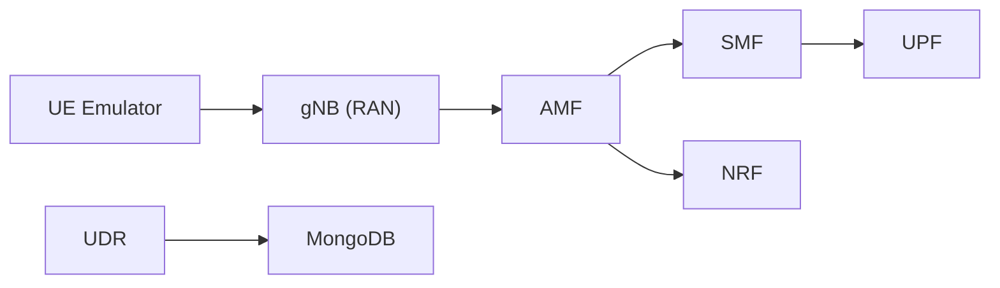

# free5gc/free5gc

> Implémentation open source du cœur de réseau mobile 5G (3GPP R15), pour opérateurs, labos et chercheurs télécoms.

## Le problème
Étudier ou tester un cœur 5G sans équipement d'opérateur propriétaire coûte cher et reste opaque.

## Ce que ça fait vraiment
README minimal : il renvoie au site et au guide. D'après le code, le dépôt regroupe des fonctions réseau indépendantes (AMF, SMF, UPF, NRF, UDM, UDR, AUSF, PCF, NSSF, CHF, NEF, TNGF, N3IWF), leurs configs YAML, leurs certificats TLS et une web console. Le UDR s'appuie sur MongoDB. Des scripts (`run.sh`, `test.sh`, `Makefile`) lancent chaque fonction comme processus séparé.

## Comment c'est branché

## Essayer
Aucune commande documentée dans le README (tout est renvoyé vers free5gc.org/guide/).

## Coût et pièges
Pas de facture directe, mais il faut un RAN ou un émulateur et un environnement Linux réseau. Installation détaillée hors README.

## Ce que ce n'est pas
Ce n'est pas un produit clé en main : la doc d'installation est externe. Ce n'est pas une brique de data science.

## Alternatives
Aucune alternative nommée dans le README.

## Pour toi
À ignorer pour un profil data/IA/MLOps : domaine télécoms sans lien avec ton métier, et README trop maigre pour juger davantage.

