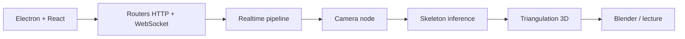

# freemocap/freemocap

> Système de capture de mouvement multi-caméras libre, pour la recherche, l'enseignement et l'entraînement.

## Le problème
La capture de mouvement professionnelle coûte cher et dépend de matériel propriétaire.

## Ce que ça fait vraiment
Un serveur Python local (port 8005) et une interface React/Electron : enregistrement de caméras, calibrage (ChArUco, Anipose ou PyCeres), détection de points du corps, triangulation 3D, cinématique optionnelle, lecture et export Blender. Un pipeline temps réel (caméra, inférence, agrégation, filtrage) diffuse les points par WebSocket. Le README lui-même précise « It might break! Work in Progress ».

## Comment c'est branché


## Essayer
```bash
pip install freemocap[cuda]
pip install freemocap[cpu]
freemocap
uv sync
uv run python freemocap/__main__.py
```

## Coût et pièges
Extra `cuda` ou `cpu` obligatoire, sinon pas de suivi. Python 3.9 à 3.11. Les dépendances (`skellytracker`, `skellycam`) viennent de dépôts git privés via `uv` : `pip install -e .` ne suffit pas depuis les sources. Des caméras sont nécessaires.

## Ce que ce n'est pas
Pas un produit stable : le README parle de branche `development` avec instructions spéciales. Licence AGPL-3.0 : copyleft fort, y compris pour un usage en réseau.

## Alternatives
Aucune alternative nommée dans le README.

## Pour toi
À surveiller : pertinent pour de la vision par ordinateur et de la capture de mouvement de recherche, mais instable et lié à une licence AGPL.

