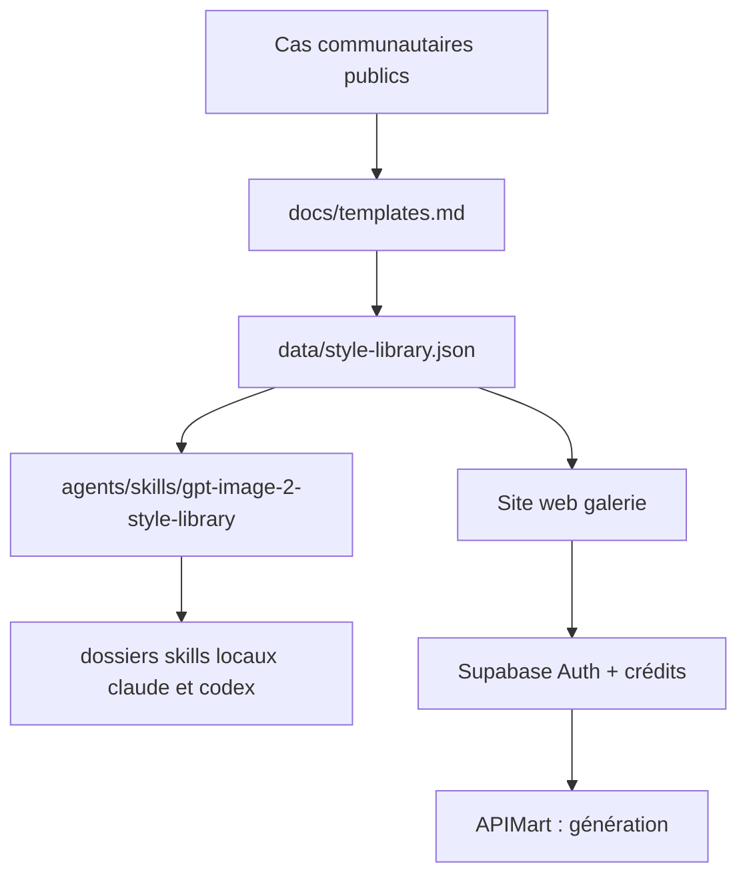

# freestylefly/awesome-gpt-image-2

> Bibliothèque de 544 cas de prompts GPT-Image2 rétro-conçus, plus des gabarits industriels et une skill.

## Le problème
La génération d'images est passée de « sait-elle faire une image ? » à « sait-elle en faire de stables, contrôlables, réutilisables ? ».
Un tas d'exemples isolés ne donne ni structure ni possibilité de génération par lot.

## Ce que ça fait vraiment
Compile 544 cas publics en « Prompt-as-Code » : schéma atomique séparant sujets, éclairage, matériaux, mise en page et détails visuels en parties composables.
Classe les cas par catégorie (UI, infographies, affiches, produits, marque, architecture, photo, illustration, personnages, narration, thèmes classiques chinois, documents, expérimentations) et fournit 4 pages de gabarits de prompts.
Embarque une agent skill `gpt-image-2-style-library`, installable par `npx skills`, par marketplace de plugins Claude Code ou par npm, qui choisit styles, gabarits, catégories et tags de scène depuis `data/style-library.json`.
Un site web (gpt-image2.canghe.ai) rend la galerie navigable, avec génération après connexion Google, crédits et paiements Stripe/Alipay.

## Comment c'est branché


## Essayer
```bash
npx skills add freestylefly/awesome-gpt-image-2 --skill gpt-image-2-style-library --agent claude-code codex --global --yes --copy
npm install -g gpt-image-2-style-library
gpt-image-2-style-library install all
```

## Coût et pièges
Le dépôt est MIT et gratuit ; la génération passe par APIMart avec votre clé, ou par les crédits payants du site.
Le README expose une longue liste de variables d'environnement Vercel, de migrations Supabase et de clés Stripe : c'est le code d'un service commercial, pas seulement une liste.

## Ce que ce n'est pas
Ce n'est pas un outil de génération d'images : c'est un catalogue de prompts et une skill de sélection.
Ce n'est pas un contenu dont les droits sont garantis : le README précise qu'il agrège des prompts et images communautaires (YouMind, OpenNana) sans en revendiquer la propriété, et qu'aucun usage commercial n'est garanti.
Ce n'est pas indépendant : la valeur ajoutée réelle est concentrée sur un site tiers monétisé.

## Alternatives
Aucune alternative n'est nommée ; les sources citées (YouMind, OpenNana) sont des origines de contenu.

## Pour toi
Peu de valeur pour un profil data/MLOps : à ignorer, sauf besoin ponctuel de visuels de présentation.
