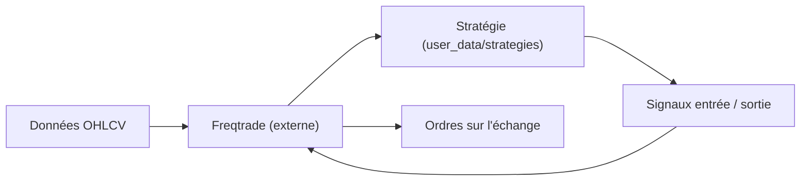

# freqtrade/freqtrade-strategies

> Recueil de stratégies d'achat/vente prêtes à copier dans le robot de trading crypto Freqtrade.

## Le problème
Partir d'une page blanche pour écrire une stratégie de trading pour Freqtrade.

## Ce que ça fait vraiment
Des fichiers Python, un par stratégie, dans `user_data/strategies` : indicateurs, signaux d'entrée et de sortie, ROI minimal, stop-loss. Sous-dossiers : stratégies portées (berlinguyinca), futures, expérimentales à biais d'anticipation (lookahead_bias), plus un fichier d'hyperopt. Le moteur, les échanges et les ordres sont dans Freqtrade, pas ici.

## Comment c'est branché


## Essayer
```bash
freqtrade backtesting --strategy Strategy001
freqtrade download-data --days 100
freqtrade trade --strategy Strategy001
```

## Coût et pièges
Gratuit, mais le risque financier est réel : le README demande backtest puis simulation avant tout argent engagé, sans garantie. Résultats dépendants des paires, période et échange. Compatible Freqtrade 2022.4 ou plus récent.

## Ce que ce n'est pas
Pas des stratégies « prêtes à l'emploi » : le README les présente comme points de départ, à optimiser.

## Alternatives
Aucune alternative nommée dans le README.

## Pour toi
À ignorer sauf projet de trading : ce sont des règles techniques classiques, sans preuve de rentabilité, et un usage réel expose à des pertes.

