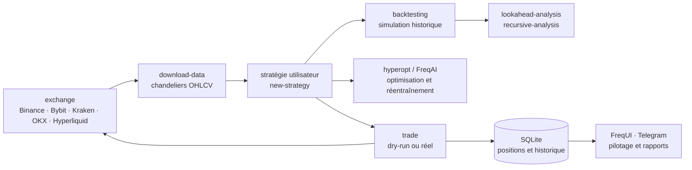

# freqtrade/freqtrade

> **A Python crypto trading bot with backtesting, parameter optimisation and remote control.**

## The problem

Automating a crypto trading strategy from scratch means rewriting the same plumbing every
time: exchange connectivity, candle downloads, position persistence, historical simulation,
money-management guardrails, and some way of stopping the bot from a phone. Each piece is
mundane on its own, but a mistake in any one of them ends in real orders placed on a market
that never closes.

## What it actually does

Freqtrade supplies the frame and leaves the strategy to the user. The README documents a
single program, `freqtrade`, whose subcommands cover the whole cycle: user directory and
configuration setup (`create-userdir`, `new-config`), a strategy skeleton (`new-strategy`),
data download and conversion (`download-data`, `convert-data`, `trades-to-ohlcv`), simulation
(`backtesting`, `backtesting-show`, `backtesting-analysis`), parameter search (`hyperopt`,
`hyperopt-list`, `hyperopt-show`), plotting (`plot-dataframe`, `plot-profit`) and finally
execution (`trade`).

The README also lists the stated features: SQLite persistence, a dry-run mode that runs the
bot without committing money, static or dynamic whitelists and blacklists of pairs, profit and
loss displayed in fiat currency, and a performance report. Two modules stand out for a data
profile: **hyperopt**, which tunes entry and exit parameters by machine learning on real
exchange data, and **FreqAI**, described as adaptive predictive modelling that retrains itself
against the market. Two methodological checks exist as commands, `lookahead-analysis`
(look-ahead bias) and `recursive-analysis` (recursive formula issues) — their presence says
these traps are common.

Control happens through the built-in web interface (FreqUI, installed via `install-ui`) or
Telegram, whose commands the README lists: `/start`, `/stop`, `/stopentry`, `/status`,
`/profit`, `/forceexit`, `/balance`, `/daily`, `/performance`.

## How it is wired



No code-derived diagram exists for this repository: the graph above is reconstructed from the
README alone, from its subcommand list and stated features. The point to keep is the loop —
the same strategy feeds backtesting, optimisation and live execution, and only the command
changes when moving from simulation to the real market.

## Trying it

**The README contains no installation command.** It points to external documentation: the
"Docker Quickstart documentation" for a fast start, the "Installation documentation page" for
native methods. Nothing is copyable here, and nothing has been reconstructed.

What the README does give is the command-line surface:

```
usage: freqtrade [-h] [-V]
                 {trade,create-userdir,new-config,show-config,new-strategy,download-data,convert-data,convert-trade-data,trades-to-ohlcv,list-data,backtesting,backtesting-show,backtesting-analysis,edge,hyperopt,hyperopt-list,hyperopt-show,list-exchanges,list-markets,list-pairs,list-strategies,list-hyperoptloss,list-freqaimodels,list-timeframes,show-trades,test-pairlist,convert-db,install-ui,plot-dataframe,plot-profit,webserver,strategy-updater,lookahead-analysis,recursive-analysis}
                 ...
```

Plus the README's explicit instruction: start in dry-run, and commit no money before
understanding how the bot works.

## Cost and traps

- **GPL-3.0 licence**: strong copyleft. A derived strategy or module that you distribute falls
  under the same terms. Internal, undistributed use is unaffected. This is the only alert kept,
  but it is structural.
- **The software is free, the risk is not.** The README opens with an all-caps disclaimer:
  educational purposes only, use at your own risk, the authors take no responsibility for your
  trading results. The real cost is not installation, it is the money committed.
- **Exchange account and API keys required** at Binance, Bybit, Kraken, OKX, Hyperliquid or one
  of the others listed. The README points to per-exchange notes: configuration differs between
  them, some are only "community tested" (Bitvavo, Kucoin), and the rest of the ccxt catalogue
  comes with no guarantee at all.
- **Python 3.11 or newer**, plus pip, git, virtualenv, and **TA-Lib** — a C library whose
  installation is the highest step on the list. Hence the Docker recommendation.
- **Stated minimum hardware**: 2GB RAM, 1GB disk, 2 vCPU on a cloud instance. The README adds a
  requirement that is easy to miss: **a clock synchronised frequently to NTP**, otherwise
  exchange communication breaks.
- **Two branches**: `stable` (latest tested release) and `develop` (new features, possible
  breaking changes). `feat/*` branches are explicitly discouraged.
- **Python skills expected**: the README strongly recommends knowing how to code and reading
  the bot's source before using it.

## What it is not

- **It is not a profitable ready-made strategy.** Freqtrade supplies the skeleton, and
  `new-strategy` creates a stub — the entry and exit logic is entirely yours to write. The
  README promises no return anywhere.
- **It is not a hosted service.** You need a machine running permanently (the README suggests a
  cloud instance), your own exchange keys and your own monitoring.
- **FreqAI is not an oracle**: it is adaptive predictive modelling retrained on market data,
  not a prediction guarantee. The very existence of `lookahead-analysis` and
  `recursive-analysis` is a reminder that a flattering backtest is usually a biased one.
- **It is not a universal connector**: only the ticked exchanges are supported, and the README
  states plainly that nothing can be guaranteed for the others.
- **It is not a black box to leave running**: the dry-run mode, the opening disclaimer and the
  demand that you read the code all say the same thing.

## Alternatives

| | When to prefer it |
|---|---|
| **jesse-ai/jesse** | A catalogue neighbour, and the only relevant comparison: another Python crypto trading framework with backtesting and strategies written in Python. Worth weighing against Freqtrade if strategy research dominates; Freqtrade is the choice for continuous operation, with FreqUI, Telegram and its list of supported exchanges. |

The other suggested neighbours are not comparable: `fastapi/fastapi` is a web framework,
`pandas-dev/pandas` a data manipulation library and `pathwaycom/pathway` a stream processing
engine — all three are generic building blocks, none of them trades. The neighbourhood was
computed lexically (Python, data, real time), not by purpose.

## For you

Worth watching rather than adopting, unless trading interests you personally: it is a mature,
documented project with an academic publication (JOSS) and continuous integration, but its
domain is narrow. What repays a look for a data or MLOps profile lies elsewhere: the way the
project frames a backtest → optimisation → execution loop around the same code, the dry-run
mode as a staging environment, and above all `lookahead-analysis` — a detector for temporal
data leakage, a problem that arises identically in any modelled time series far outside
finance. Read it for those ideas; install it only if you actually intend to commit money.
