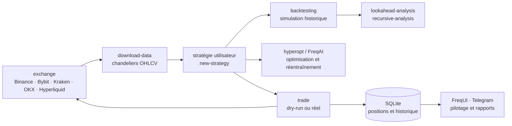

# freqtrade/freqtrade

> **Un robot de trading crypto en Python, avec backtest, optimisation et pilotage à distance.**

## Le problème

Automatiser une stratégie de trading crypto sans cadre oblige à réécrire à chaque fois la même
plomberie : connexion à l'exchange, téléchargement des chandeliers, persistance des positions,
simulation historique, garde-fous de gestion du capital, et un moyen d'arrêter le robot depuis
son téléphone. Chacune de ces pièces est banale prise seule, mais une erreur sur n'importe
laquelle se solde par des ordres réels passés sur un marché ouvert en continu.

## Ce que ça fait vraiment

Freqtrade fournit le socle et laisse la stratégie à l'utilisateur. Le README annonce un
programme unique, `freqtrade`, dont les sous-commandes couvrent tout le cycle : création du
répertoire utilisateur et de la configuration (`create-userdir`, `new-config`), squelette de
stratégie (`new-strategy`), téléchargement et conversion des données (`download-data`,
`convert-data`, `trades-to-ohlcv`), simulation (`backtesting`, `backtesting-show`,
`backtesting-analysis`), optimisation des paramètres (`hyperopt`, `hyperopt-list`,
`hyperopt-show`), tracés (`plot-dataframe`, `plot-profit`) et enfin exécution (`trade`).

Le README détaille aussi les fonctions annoncées : persistance en SQLite, mode *dry-run* qui
fait tourner le robot sans engager d'argent, listes blanches et noires de paires (statiques ou
dynamiques), affichage du résultat converti en monnaie fiduciaire, rapport de performance.
Deux modules sortent du lot pour un profil data : **hyperopt**, qui cherche les paramètres
d'entrée/sortie par apprentissage automatique sur données réelles d'exchange, et **FreqAI**,
présenté comme un modèle prédictif adaptatif qui se ré-entraîne au fil du marché. Deux
commandes de contrôle méthodologique existent, `lookahead-analysis` (biais d'anticipation) et
`recursive-analysis` (formule récursive) — leur présence dit que ces pièges sont fréquents.

Le pilotage se fait par interface web intégrée (FreqUI, installée par `install-ui`) ou par
Telegram, dont le README liste les commandes : `/start`, `/stop`, `/stopentry`, `/status`,
`/profit`, `/forceexit`, `/balance`, `/daily`, `/performance`.

## Comment c'est branché



Aucun diagramme tiré du code n'existe pour ce dépôt : ce schéma est reconstruit depuis le seul
README, à partir de la liste des sous-commandes et des fonctions annoncées. Le point à retenir
est la boucle : la même stratégie alimente le backtest, l'optimisation et l'exécution, et seule
la commande change pour passer de la simulation au marché réel.

## Essayer

**Le README ne contient aucune commande d'installation.** Il renvoie à la documentation
externe : « Docker Quickstart documentation » pour le démarrage rapide, « Installation
documentation page » pour les méthodes natives. Rien n'est donc copiable ici, et rien n'a été
reconstruit.

Ce que le README donne en revanche, c'est la surface de la ligne de commande :

```
usage: freqtrade [-h] [-V]
                 {trade,create-userdir,new-config,show-config,new-strategy,download-data,convert-data,convert-trade-data,trades-to-ohlcv,list-data,backtesting,backtesting-show,backtesting-analysis,edge,hyperopt,hyperopt-list,hyperopt-show,list-exchanges,list-markets,list-pairs,list-strategies,list-hyperoptloss,list-freqaimodels,list-timeframes,show-trades,test-pairlist,convert-db,install-ui,plot-dataframe,plot-profit,webserver,strategy-updater,lookahead-analysis,recursive-analysis}
                 ...
```

Et la consigne explicite du README : commencer en *dry-run* et ne pas engager d'argent avant
d'avoir compris le fonctionnement du robot.

## Coût et pièges

- **Licence GPL-3.0** : copyleft fort. Une stratégie ou un module dérivé qu'on distribue tombe
  sous la même licence. Usage interne non distribué : sans conséquence. C'est la seule alerte
  retenue, mais elle est structurelle.
- **Le logiciel est gratuit, le risque non.** Le README ouvre sur un avertissement en
  majuscules : logiciel à visée éducative, usage à vos risques, les auteurs déclinent toute
  responsabilité sur vos résultats. Le vrai coût n'est pas l'installation, c'est l'argent
  engagé.
- **Compte et clés d'exchange à créer** chez Binance, Bybit, Kraken, OKX, Hyperliquid ou l'un
  des autres listés. Le README renvoie à des « notes spécifiques par exchange » : la
  configuration diffère de l'un à l'autre, et certains ne sont que « testés par la
  communauté » (Bitvavo, Kucoin), voire non garantis (le reste du catalogue ccxt).
- **Python 3.11 minimum**, plus pip, git, virtualenv, et **TA-Lib** — une bibliothèque C dont
  l'installation est la marche la plus haute de la liste. D'où la recommandation Docker.
- **Matériel minimal annoncé** : 2 Go de RAM, 1 Go de disque, 2 vCPU, sur une instance cloud.
  Le README ajoute une exigence facile à manquer : **horloge synchronisée NTP fréquemment**,
  sous peine de problèmes de communication avec les exchanges.
- **Deux branches** : `stable` (dernière version testée) et `develop` (nouveautés, mais
  changements cassants possibles). Les branches `feat/*` sont explicitement déconseillées.
- **Compétences en Python exigées** : le README recommande fortement de savoir coder et de lire
  le code source du robot avant de l'utiliser.

## Ce que ce n'est pas

- **Ce n'est pas une stratégie rentable prête à l'emploi.** Freqtrade fournit l'ossature et la
  commande `new-strategy` crée un squelette — la logique d'entrée et de sortie reste entièrement
  à écrire. Aucun rendement n'est promis nulle part dans le README.
- **Ce n'est pas un service hébergé.** Il faut une machine allumée en permanence (le README
  suggère une instance cloud), ses propres clés d'exchange, sa propre surveillance.
- **FreqAI n'est pas un oracle** : c'est une modélisation prédictive adaptative qui se
  ré-entraîne sur les données du marché, pas une garantie de prédiction. La présence même de
  `lookahead-analysis` et `recursive-analysis` rappelle qu'un backtest flatteur est le plus
  souvent un backtest biaisé.
- **Ce n'est pas un connecteur universel** : seuls les exchanges cochés sont pris en charge, et
  le README écrit noir sur blanc qu'il ne peut rien garantir pour les autres.
- **Ce n'est pas une boîte noire à laisser tourner** : le mode dry-run, l'avertissement liminaire
  et l'exigence de lire le code disent tous la même chose.

## Alternatives

| | Quand le préférer |
|---|---|
| **jesse-ai/jesse** | Voisin du catalogue, et la seule comparaison pertinente : autre cadre Python de trading crypto avec backtest et stratégies écrites en Python. À évaluer en face de Freqtrade si l'on cherche surtout la recherche de stratégie ; Freqtrade à préférer pour l'exploitation en continu, avec FreqUI, Telegram et la liste d'exchanges pris en charge. |

Les autres voisins proposés ne sont pas comparables : `fastapi/fastapi` est un cadre web,
`pandas-dev/pandas` une bibliothèque de manipulation de données et `pathwaycom/pathway` un
moteur de traitement de flux — tous trois sont des briques génériques, aucun ne fait de
trading. Le voisinage a été calculé par lexique (Python, données, temps réel), pas par usage.

## Pour toi

À surveiller plutôt qu'à adopter, sauf intérêt personnel pour le trading : c'est un logiciel
mûr, documenté, avec publication académique (JOSS) et intégration continue, mais son domaine
est étroit. Ce qui vaut le détour pour un profil data/MLOps est ailleurs : la façon dont le
projet cadre une boucle backtest → optimisation → exécution avec le même code, le mode dry-run
comme préproduction, et surtout `lookahead-analysis` — un outil de détection de fuite de données
temporelle, problème qui se pose à l'identique dans toute série temporelle modélisée hors
finance. À lire pour ces idées ; à installer seulement si l'on compte réellement engager de
l'argent.
