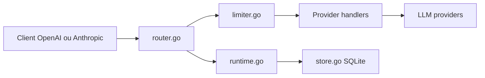

# fruitbars/simple-one-api

> Passerelle LLM multi-fournisseurs en Go, avec pool de clés, limites de débit et console web, pour hébergeurs.

## Le problème
Jongler entre plusieurs fournisseurs et clés d'API, avec des 429 en rafale dès que les requêtes sont volumineuses.

## Ce que ça fait vraiment
Expose `/v1/chat/completions`, `/v1/responses`, `/v1/messages` et les embeddings devant plusieurs fournisseurs. Un pool de clés choisit la clé qui peut absorber la requête (estimation de tokens, fenêtre de 60 s), refroidit sur 429 et bascule. Limites QPS/RPM/TPM/concurrence sur quatre niveaux, console React embarquée, config en SQLite, stats d'usage sans prompts, appli de bureau Wails.

## Comment c'est branché


## Essayer
```bash
docker pull ghcr.io/fruitbars/simple-one-api:latest
docker run -d --name simple-one-api -p 9090:9090 \
  -v /absolute/path/config.json:/app/config.json:ro \
  -v /absolute/path/data:/app/data \
  -e SIMPLE_ONE_API_DB=/app/data/config.db \
  ghcr.io/fruitbars/simple-one-api:latest
```

## Coût et pièges
Tes propres clés amont. SQLite sans chiffrement au repos ; l'état de capacité vit en mémoire et se perd au redémarrage. Les docs fournisseurs du dépôt peuvent être périmées.

## Ce que ce n'est pas
Pas un outil de facturation : les capacités affichées viennent d'une fenêtre locale, pas du solde du fournisseur. README en chinois d'abord.

## Alternatives
Aucune alternative nommée dans le README.

## Pour toi
À surveiller : le routage sensible à la capacité TPM règle un vrai problème de 429 sur gros contextes, mais mainteneur unique et README sans comparatif ; teste-le seulement si tu mutualises des clés.

