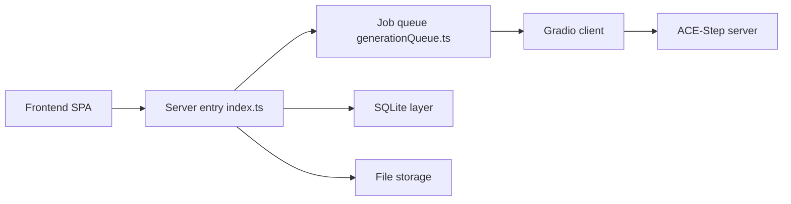

# fspecii/ace-step-ui

> Interface web locale pour générer de la musique avec le modèle ACE-Step 1.5, sur ton propre GPU.

## Le problème
Le modèle ACE-Step ne propose qu'un serveur Gradio brut ; il manque une bibliothèque, un lecteur et des outils audio.

## Ce que ça fait vraiment
Une SPA React appelle un backend Express/SQLite, dont `generationQueue.ts` et `gradio-client.ts` transmettent les jobs au serveur ACE-Step (port 8001). Elle ajoute playlists, likes, éditeur AudioMass, séparation de pistes Demucs et vidéos avec fonds Pexels. Un `geminiService.ts` existe côté frontend, sans détail dans le README.

## Comment c'est branché


## Essayer
```bash
git clone https://github.com/fspecii/ace-step-ui
cd ace-step-ui
./setup.sh
./start-all.sh
```

## Coût et pièges
Il faut installer ACE-Step 1.5 à part (modèles d'environ 5 Go) et un GPU NVIDIA de 4 Go minimum, 12 Go pour le mode LLM. Pexels demande une clé optionnelle. Aucune licence déclarée.

## Ce que ce n'est pas
Ce n'est pas le modèle : sans ACE-Step lancé, l'interface ne sert à rien. Les comparaisons avec Suno du README sont du marketing. Le README se termine par une offre de services web du même auteur.

## Alternatives
- ACE-Step-1.5 : le moteur lui-même, sans interface.
- Pinokio : installation en un clic citée dans le README.

## Pour toi
À surveiller : pratique pour tester un modèle musical local, mais absence de licence et dépendance à un projet tiers.

