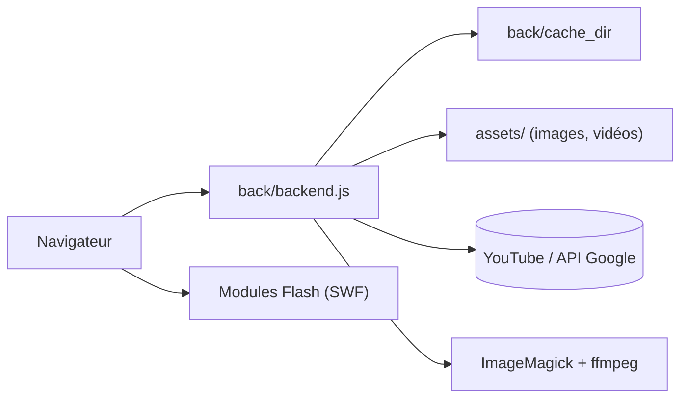

# ftde0/yt2009

> Reconstitution assez fidèle de l'interface YouTube de 2009, avec fonctions de compte, à héberger soi-même.

## Le problème
Retrouver l'interface et le lecteur Flash de YouTube de 2009 avec des vidéos actuelles, sans que le site d'origine le permette.

## Ce que ça fait vraiment
Un serveur Node.js (`back/backend.js`) sert des pages HTML de 2009 et des modules Flash, récupère les données vidéo côté YouTube (clé Google Data API v3 recommandée, source Wayback Machine possible), met en cache et télécharge images et vidéos via ImageMagick et ffmpeg. Une connexion au vrai compte YouTube est possible. Option Docker fournie.

## Comment c'est branché


## Essayer
```bash
npm install --allow-git=root
node yt2009setup.js
node post_config_setup.js
cd back
node backend.js
git pull --no-commit
```

## Coût et pièges
Gratuit ; ImageMagick, ffmpeg et Node requis. L'espace disque peut atteindre des dizaines de Go. Les changements côté YouTube cassent régulièrement l'outil, d'où la mise à jour via git.

## Ce que ce n'est pas
Ce n'est pas un service officiel ni stable : le README annonce des ruptures fréquentes. La conformité aux conditions d'usage de YouTube n'est pas traitée.

## Alternatives
Le README ne cite aucune alternative.

## Pour toi
À ignorer : projet de nostalgie web, sans lien avec un travail data/IA/MLOps.

