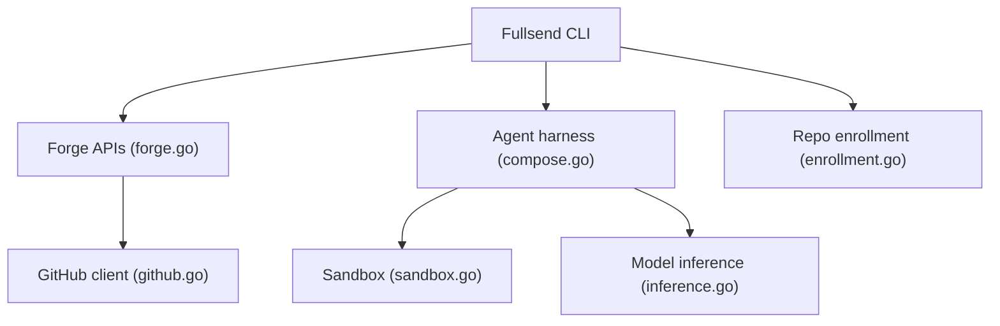

# fullsend-ai/fullsend

> Agents autonomes qui trient, implémentent, relisent et fusionnent du code pour des organisations Git.

## Le problème
Le flux issue → code → revue → merge mobilise des humains à chaque étape ; l'automatiser pose des questions de sécurité.

## Ce que ça fait vraiment
Le README (court) annonce des agents pour GitHub, GitLab, Forgejo, « secure by design », et renvoie à fullsend.sh. D'après le code : une CLI, un harnais d'agents avec sandbox, un poller Jira, l'enrôlement de dépôts, un service de récupération de skills et un service de jetons. Détails non documentés dans le README.

## Comment c'est branché

## Essayer
Aucune commande documentée dans le README : voir fullsend.sh (guides de démarrage).

## Coût et pièges
Inférence de modèle probablement à ta charge et droits d'écriture sur tes dépôts ; non chiffré dans le README. 1 929 issues ouvertes.

## Ce que ce n'est pas
Pas une doc d'usage : le README est un pointeur. « Merge to production autonomously » est une promesse non vérifiable ici.

## Alternatives
Aucune alternative nommée dans le README.

## Pour toi
Surveiller : sujet pertinent pour le MLOps (agents + sécurité d'exécution) et actif, mais il faut lire fullsend.sh avant de juger.

