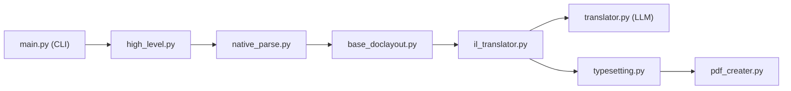

# funstory-ai/BabelDOC

> Bibliothèque et CLI qui traduisent des PDF scientifiques en conservant la mise en page, pour intégrateurs.

## Le problème
Traduire un article PDF avec formules, tableaux et figures casse la mise en page. Les services de conversion perdent la structure d'origine ou coûtent cher.

## Ce que ça fait vraiment
Parse le PDF en représentation intermédiaire, détecte la mise en page (modèle de layout, RPC possible) et les paragraphes, traduit via un LLM compatible OpenAI, puis recompose un PDF mono ou bilingue. Glossaire (CSV et extraction automatique), découpage de gros documents, contournement OCR pour les scans. Le README dit que le CLI est surtout destiné au débogage et que l'API Python est interne, non supportée.

## Comment c'est branché


## Essayer
```bash
uv tool install --python 3.12 BabelDOC
babeldoc --help
babeldoc --openai --openai-model "gpt-4o-mini" --openai-base-url "https://api.openai.com/v1" --openai-api-key "your-api-key-here" --files example.pdf
```

## Coût et pièges
Appels LLM à ta charge (seul moteur supporté : API compatible OpenAI). Modèles et polices téléchargés au premier lancement (`--warmup`, paquet hors ligne possible).

## Ce que ce n'est pas
Pas un produit final : aucun support technique pour le CLI selon le README. Surtout testé anglais→chinois. Limites connues : auteurs/références fusionnés, lignes et lettrines non gérées, grandes pages ignorées. AGPL-3.0 : contraignant si tu l'embarques dans un service.

## Alternatives
- PDFMathTranslate (2.0) : déploiement autonome avec WebUI et plus de moteurs de traduction.
- Immersive Translate : service en ligne avec quota gratuit.

## Pour toi
À surveiller : utile pour traduire des papiers de recherche avec une API LLM, mais API interne instable et licence AGPL, donc préférer PDFMathTranslate pour un usage clé en main.

