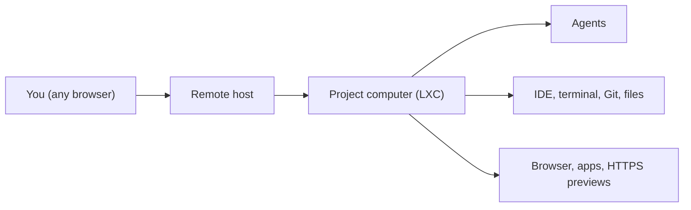

# futrx-com/remote.futrx

> Plateforme auto-hébergée qui donne à chaque projet un conteneur Linux où travaillent des agents de code, pilotée depuis un navigateur.

## Le problème
Les agents de code tournent sur ton portable, sans environnement durable, partageable ni isolé par projet.

## Ce que ça fait vraiment
Un conteneur LXC non privilégié par projet, avec chat d'agent (Codex, MiniMax, Claude Code, Kimi, Antigravity), IDE navigateur, terminal, fichiers, Git, aperçus HTTPS et navigateur partagé. Tâches planifiées, secrets par projet, membres, 2FA, suivi d'usage et de coût. Les agents continuent quand le portable est fermé.

## Comment c'est branché


## Essayer
```bash
curl -fsSL https://remote.futrx.com/get | sudo bash -s -- remote.example.com
journalctl -u remote --since "-10 min" | grep -A2 "first-time setup"
sudo remote setup-token
sudo bash /opt/remote.futrx/infra/update.sh
```

## Coût et pièges
Serveur Ubuntu/Debian avec accès root, nom de domaine avec sous-domaines génériques, ports 80/443. L'installateur désactive la connexion SSH par mot de passe. Abonnements ou clés des fournisseurs d'agents à ta charge ; MiniMax exige une clé de plan à jetons.

## Ce que ce n'est pas
Pas un modèle d'IA ni une isolation forte : les conteneurs partagent le noyau de l'hôte, l'administrateur voit tout, les secrets sont lisibles par les agents. Le stockage n'est pas une sauvegarde.

## Alternatives
Aucune alternative nommée dans le README.

## Pour toi
À surveiller : pertinent pour un MLOps qui veut héberger des environnements d'agents ; examiner le modèle de menace et la licence non identifiée avant usage.

