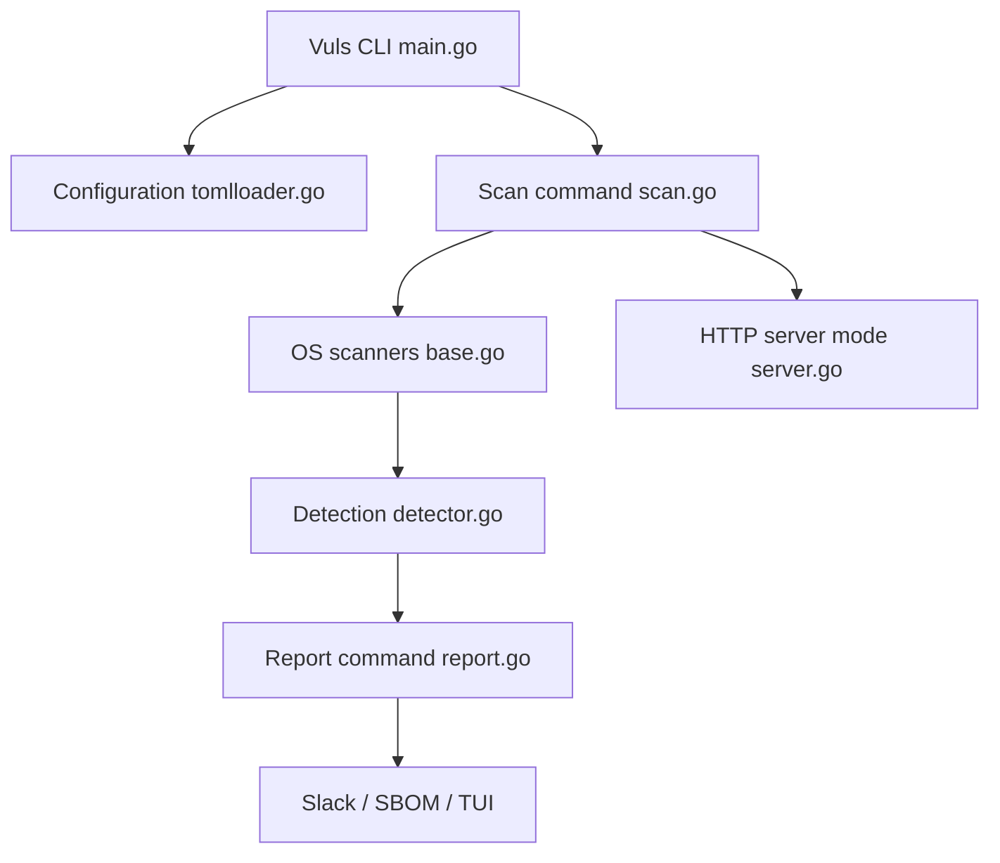

# future-architect/vuls

> Scanner de vulnérabilités sans agent, en Go, pour administrateurs de serveurs Linux, FreeBSD, Windows et macOS.

## Le problème
Les administrateurs doivent surveiller à la main les nouvelles failles (NVD, etc.) et déterminer quels serveurs sont touchés, avec le risque d'en oublier.

## Ce que ça fait vraiment
Vuls collecte la liste des logiciels d'un système, la croise avec des bases de vulnérabilités (NVD, JVN, OVAL, avis des distributions, catalogues KEV) et signale les serveurs concernés. Trois modes : scan distant par SSH, scan local, mode serveur HTTP. Il couvre aussi les bibliothèques (fichiers de verrouillage), WordPress et la détection par CPE. Rapports par e-mail, Slack, TUI ou VulsRepo ; sortie SBOM. Il ne met pas à jour les paquets.

## Comment c'est branché

## Essayer
Aucune commande documentée dans le README : renvoi à vuls.io pour l'installation et l'usage.

## Coût et pièges
Gratuit. Il faut récupérer les bases de vulnérabilités (accès internet, sauf mode hors-ligne pour certaines distributions) et un accès SSH aux cibles pour le mode distant. À n'utiliser que sur des systèmes dont on a la charge ; le README précise que le scan est non destructif.

## Ce que ce n'est pas
Pas un correcteur : il ne met pas à jour les paquets vulnérables. Pas un outil d'attaque : il détecte et rapporte, même si ses sources citent des PoC et exploits publics comme enrichissement. Licence GPL-3.0 (copyleft).

## Alternatives
Le README ne cite pas d'outil concurrent ; non documenté.

## Pour toi
À adopter si tu gères des serveurs ou des environnements d'entraînement : surveillance automatisée et planifiable (cron/CI) des CVE, avec projet actif (dernier push 2026-09-18).

