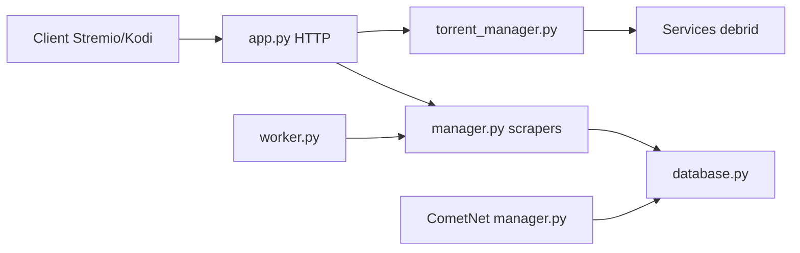

# g0ldyy/comet

> Addon Stremio qui agrège des sources de torrents et les diffuse via des services debrid.

## Le problème
Trouver des flux de torrents fiables pour Stremio, Kodi ou Prowlarr demande de multiplier les scrapers.

## Ce que ça fait vraiment
Serveur auto-hébergé qui interroge de nombreux scrapers, classe les torrents, met en cache (SQLite ou PostgreSQL) et sert des flux via des services debrid (Real-Debrid, AllDebrid, TorBox…). Offre une interface Kodi, Torznab, un tableau de bord et CometNet, un réseau P2P de partage de métadonnées.

## Comment c'est branché


## Essayer
```bash
git clone https://github.com/g0ldyy/comet
cd comet
pip install uv
uv sync
uv run python -m comet.main
```

## Coût et pièges
Un abonnement debrid est généralement nécessaire. Variables d'environnement nombreuses.

## Ce que ce n'est pas
Ne fournit ni fichiers ni contenu : il agrège des métadonnées de torrents.

## Alternatives
Aucune alternative nommée comme telle ; le README cite Jackett, Prowlarr et Torrentio parmi les scrapers pris en charge.

## Pour toi
À ignorer : sert le téléchargement de torrents et n'a aucun rapport avec data, IA ou MLOps.

