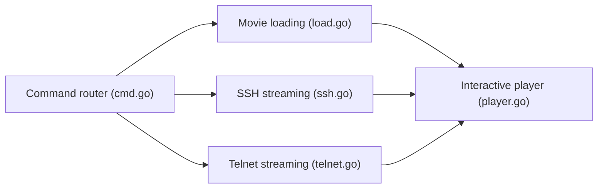

# gabe565/ascii-movie

> Diffuse le film Star Wars en ASCII dans un terminal, par SSH ou Telnet.

## Le problème
Aucun problème pratique : c'est un divertissement de terminal.

## Ce que ça fait vraiment
CLI Go : `play` joue un film dans le terminal avec interface interactive (clavier, souris), `serve` héberge des serveurs SSH et Telnet. Films embarqués ou fichiers locaux, API de métriques pour `get stream`. Une instance publique est indiquée à `starwarstel.net`.

## Comment c'est branché


## Essayer
```bash
ssh starwarstel.net
telnet starwarstel.net
docker run --rm -it ghcr.io/gabe565/ascii-movie play
sudo docker run --port=22:22 --port=23:23 ghcr.io/gabe565/ascii-movie serve
```

## Coût et pièges
Gratuit. Ports 22/23 pour l'hébergement ; le README mentionne un serveur SSH sur 2222 et utilise 22 dans l'exemple.

## Ce que ce n'est pas
Pas un outil de travail. Incohérence du README sur le port SSH (2222 puis 22).

## Alternatives
Inspiré d'asciimation et de towel.blinkenlights.nl.

## Pour toi
À ignorer : curiosité sans valeur professionnelle ; seul l'exemple de serveur SSH/Telnet en Go peut instruire.

