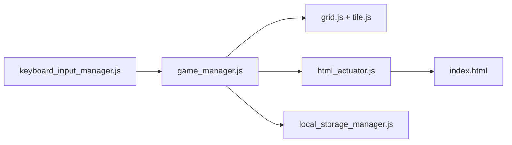

# gabrielecirulli/2048

> Petit clone du jeu 2048 en HTML, CSS et JavaScript, pour jouer dans le navigateur.

## Le problème
Aucun problème métier : c'est un jeu fait pour le plaisir, selon l'auteur.

## Ce que ça fait vraiment
Jeu de tuiles sur grille : les flèches ou les balayages tactiles fusionnent les tuiles. `game_manager.js` orchestre, `grid.js` et `tile.js` portent l'état, `html_actuator.js` met à jour le DOM, `local_storage_manager.js` garde le meilleur score. Des polyfills assurent la compatibilité de vieux navigateurs.

## Comment c'est branché

## Essayer
Aucune commande : le README renvoie à une version jouable en ligne et aux applications Play Store et App Store.

## Coût et pièges
Gratuit, sans hébergement. Dernier push le 2024-10-24 (plus d'un an). Le README demande des dons en BTC.

## Ce que ce n'est pas
Pas un projet de référence pour l'IA : c'est un jeu ; aucun test ni build moderne mentionnés.

## Alternatives
Aucune alternative citée dans le README (1024 et Threes sont cités comme inspirations).

## Pour toi
À ignorer : jeu sans intérêt professionnel, et peu actif ; à réserver à la curiosité.

