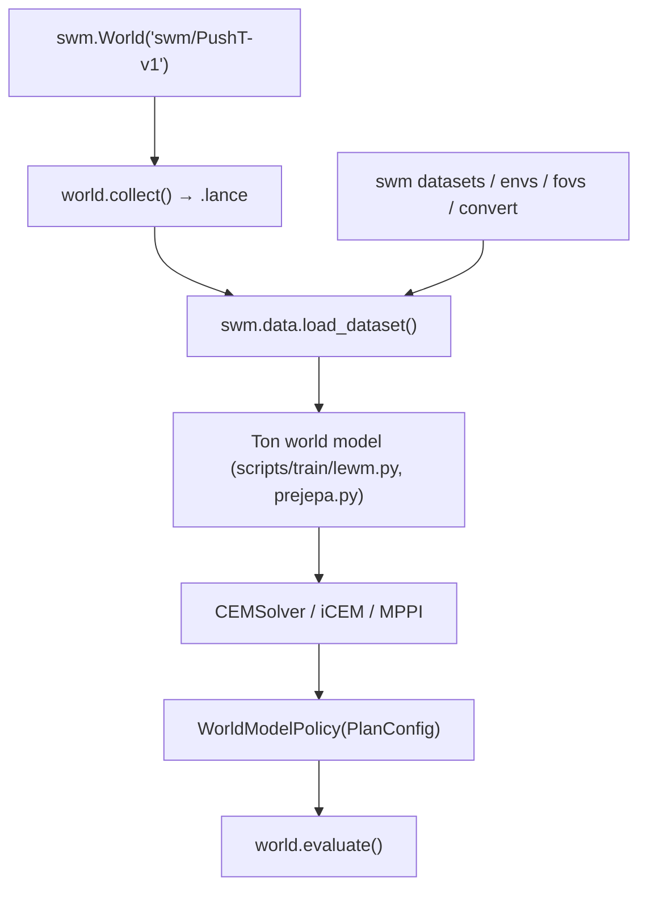

# galilai-group/stable-worldmodel

> Interface unifiée pour collecter, entraîner et évaluer des world models en contrôle prédictif.

## Le problème
Chaque papier de world model réécrit sa collecte de données, son format de dataset et son
solveur MPC, ce qui rend les comparaisons impossibles.

## Ce que ça fait vraiment
Couvre les trois étapes derrière une même API : `world.collect()` enregistre des épisodes,
`swm.data.load_dataset()` les relit avec autodétection du format, `world.evaluate()` évalue
une politique construite sur un solveur. Cinq formats de dataset via un registre extensible
(lance par défaut, hdf5, folder, video, lerobot en lecture seule) avec des chiffres de débit
mesurés et reproductibles par `scripts/benchmark/compare_h5_lance.py`. Une trentaine
d'environnements (DeepMind Control Suite, Gymnasium, OGBench, Craftax, 100+ jeux Atari, PushT,
Two-Room), la plupart livrés avec des facteurs de variation visuels et physiques pour tester
la généralisation zéro-shot. Sept solveurs (CEM, iCEM, MPPI, predictive sampling, SGD/Adam,
PGD, lagrangien augmenté) et six baselines (DINO-WM, PLDM, LeWM, GCBC, GCIVL, GCIQL).

## Comment c'est branché


## Essayer
```bash
pip install 'stable-worldmodel[data]'    # recommended: base + Lance dataset I/O
pip install 'stable-worldmodel[all]'     # + training, environments, and data formats
uv venv --python=3.10 && source .venv/bin/activate
uv sync --extra all --group dev
swm envs
swm fovs PushT-v1
swm convert pusht_expert_train --dest-format video
```

## Coût et pièges
Gratuit. L'extra `[data]` tire la pile Lance (~410 Mo de wheels natives), d'où sa séparation.
Le support LeRobot est un extra distinct exigeant Python 3.12+. Les datasets et checkpoints
vont sous `$STABLEWM_HOME` (`~/.stable_worldmodel/` par défaut). Le README prévient :
bibliothèque en développement actif, API susceptible de changer entre versions mineures.

## Ce que ce n'est pas
Ce n'est pas un world model : c'est le harnais autour. Les baselines fournies sont des
implémentations de référence, pas forcément les poids des papiers. Les chiffres de débit
portent sur un dataset PushT précis et un H200, pas sur ton matériel.

## Alternatives
- LeRobot, dont les datasets sont lisibles via l'adaptateur `lerobot://`, pour la robotique.

## Pour toi
Pertinent si tu fais de la recherche en world models ou en MPC ; peu utile en production.
