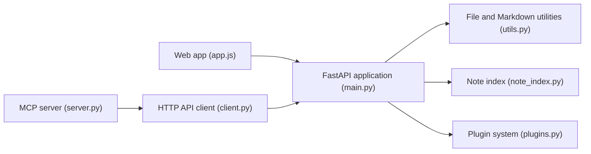

# gamosoft/NoteDiscovery

> Application web auto-hébergée de notes Markdown avec graphe, tags et serveur MCP, pour usage personnel.

## Le problème
Garder ses notes en Markdown simple, sous son contrôle, avec recherche et liens, sans service commercial.

## Ce que ce n'est pas
(voir plus bas)

## Ce que ça fait vraiment
Une application FastAPI sert une interface web sur des fichiers Markdown en dossiers : recherche, tags, rétroliens, graphe de notes, modèles, LaTeX, Mermaid, éditeur de dessin, export HTML, partage par lien, plugins et thèmes. Un serveur MCP expose les notes à Claude ou Cursor ; une pile Docker Compose avec Ollama et Open WebUI est fournie.

## Comment c'est branché


## Essayer
```bash
mkdir -p notediscovery/data && cd notediscovery
docker run -d --name notediscovery -p 8000:8000 \
  -v $(pwd)/data:/app/data \
  ghcr.io/gamosoft/notediscovery:latest
# puis http://localhost:8000
```

## Coût et pièges
Gratuit. L'authentification est désactivée par défaut et le mot de passe par défaut est `admin` : l'activer et le changer avant toute exposition réseau. Écoute sur `0.0.0.0:8000`.

## Ce que ce n'est pas
Pas fait pour être exposé sur Internet sans reverse proxy HTTPS. Pas de multi-utilisateur natif.

## Alternatives
- Notion, Evernote, Obsidian Sync : services commerciaux comparés dans le README.

## Pour toi
À surveiller : pratique pour une base de notes locale branchée à un assistant via MCP, mais jeune (novembre 2025) et mono-mainteneur.

