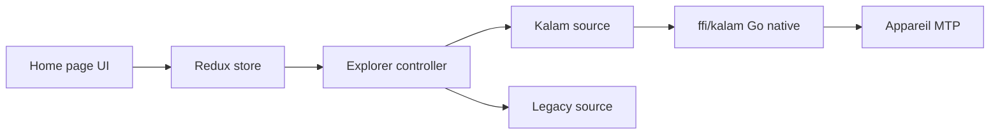

# ganeshrvel/openmtp

> Application macOS pour transférer des fichiers vers Android et appareils MTP en USB.

## Le problème
L'application officielle Android File Transfer de Google plafonne à 4 Go par fichier, se déconnecte souvent et ne permet pas de renommer.

## Ce que ça fait vraiment
Application Electron/React avec un noyau MTP écrit en Go (« Kalam »), volet double Mac/appareil, glisser-déposer, fichiers de plus de 4 Go, thème sombre. Annonce 30 à 40 Mo/s sur appareils modestes et 100 à 120 Mo/s sur haut de gamme. L'architecture révèle Sentry, Google Analytics et Mixpanel, alors que le README dit ne collecter aucune donnée personnelle.

## Comment c'est branché


## Essayer
```bash
brew install openmtp --cask
```

## Coût et pièges
Gratuit. macOS 11 minimum. Compiler depuis les sources demande Node 16, Yarn et Sentry CLI ; la publication exige signature et notarisation Apple.

## Ce que ce n'est pas
Pas multiplateforme (macOS uniquement). Pas une solution Wi-Fi ni ADB : c'est de l'USB/MTP.

## Alternatives
L'application Android File Transfer de Google est citée, pour ses limites seulement.

## Pour toi
À ignorer : utilitaire de bureau macOS sans lien avec un travail data/IA/MLOps.

