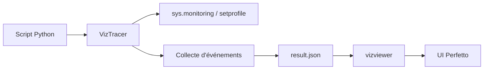

# gaogaotiantian/viztracer

> Traceur Python à faible surcoût qui visualise l'exécution sur une timeline Perfetto.

## Le problème
cProfile donne des agrégats, pas une chronologie : difficile de comprendre threads, async ou appels PyTorch.

## Ce que ça fait vraiment
Il enregistre chaque entrée et sortie de fonction ; `vizviewer` sert le rapport sur localhost:9001.
Il gère threading, multiprocessing, async, et PyTorch via `--log_torch` (événements GPU).
Filtres (profondeur, fichiers, durée min), logs de variables sans modifier le code, événements personnalisés.
Magics Jupyter, attache à distance, extension VS Code.

## Comment c'est branché


## Essayer
```bash
pip install viztracer
viztracer my_script.py arg1 arg2
vizviewer result.json
viztracer --log_torch your_model.py
```

## Coût et pièges
Gratuit. Le surcoût peut atteindre 3 à 4× sur du code très récursif ; installe `orjson` pour accélérer la sauvegarde.

## Ce que ce n'est pas
Pas un profileur par échantillonnage : il trace tout, donc il est plus lent qu'un sampler.

## Alternatives
- cProfile : profileur standard, moins détaillé.

## Pour toi
À adopter pour déboguer un pipeline de données ou un entraînement PyTorch lent : la timeline montre ce qu'un profil agrégé cache.
