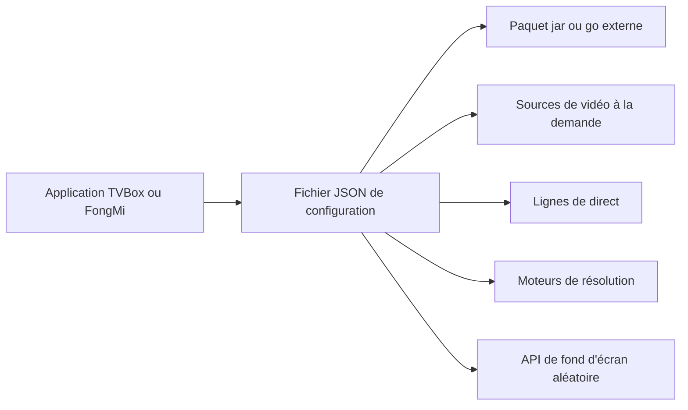

# gaotianliuyun/gao

> **A repository of JSON configuration files for the Chinese TVBox, FongMi and CatVod players.**

## The problem

TVBox-style players are useless without a configuration file listing video sources, live
channel lines and parsing engines. Without someone maintaining such a file, a user has to
assemble scattered URLs by hand and fix them every time a source goes down.

## What it actually does

There is no application code here: the repository holds JSON configuration files and a list
of links. The README enumerates eight configurations — `0707.json` for FongMi only,
`0821.json` built on 饭太硬's configuration with extra VOD sources, live lines and parsers,
`0825.json` using a jar from Panda Groove, `0826.json` taken entirely from 饭太硬,
`0827.json` taken from fongmi, `js.json` using a Panda Groove go package with resources from
道长's drpy repository, `XYQ.json` from 香雅情, and `/cat/js/config_open.json` for cat
sources, whose resources the README says are no longer updated. It also lists four client
applications, eleven configurations maintained by other people, and twelve random-wallpaper
URLs. The author states he guarantees neither the validity nor the freshness of the configs.

## How it is wired



No code-derived diagram exists for this repository; the graph above is inferred from the
README alone. A client (FongMi/TV, TVBoxOS, Box, CatVodOpen) loads one of the JSON files,
which in turn points to a jar or go package hosted elsewhere, to VOD sources, live lines,
parsers, and possibly to one of the listed wallpaper endpoints. Everything that matters lives
with third parties; the repository is only the entry point.

## Trying it

```bash
# The README documents no command.
```

The README gives no command line and no installation procedure: it only names the JSON files
and points to client applications. For PG network usage it defers to another page:
https://github.com/gaotianliuyun/gao/blob/gaotianliuyun-patch-1/README.md

## Cost and traps

Nothing to pay and nothing to install on the repository side, but a third-party application
and the remote sources are required. The traps are elsewhere: no license is declared, and the
README opens with a long disclaimer forbidding commercial use, forbidding any redistribution,
asking users not to use the content inside mainland China and to delete it within 24 hours.
The author explicitly states he does not guarantee the legality, accuracy, completeness or
validity of the content, and that resources come from third-party sharing and will be removed
on infringement notice. Several listed links are exotic or ideogram domains with no evidence
of durability.

## What it is not

It is not a player, an application or a library: without a TVBox client installed separately,
the repository does nothing. It is not a content source either — videos, jars and parsers are
hosted by third parties the author did not write and does not answer for. And it is not a
project maintained with guarantees: the README calls it a personal repository, invites people
to fork it for their own use, and promises updates only as far as the author can manage.

## Alternatives

The README itself names other third-party configurations, among them 饭太硬
(http://www.饭太硬.top/tv/), okjack (jihulab.com/okcaptain/kko) and 南风
(agit.ai/Yoursmile7/TVBox): the choice comes down to how fresh the sources are, not to
features. On the client side it points to FongMi/TV for multi-line live and screen casting,
q215613905/TVBoxOS and takagen99/Box for live replay, and catvod/CatVodOpen for a
multi-platform interface. No catalogue neighbours were provided for this repository.

## For you

Of no interest to a data / AI / MLOps profile: no code, no model, no tooling — just
configuration files for consumer streaming, with no license and an explicit legal warning.
The star count reflects domestic usage, not reusable technical quality. Skip it.
