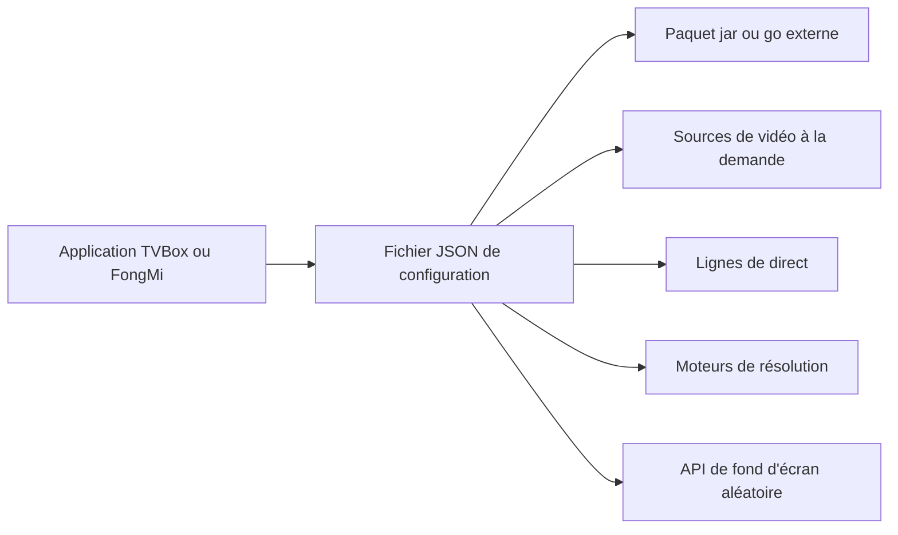

# gaotianliuyun/gao

> **Dépôt de fichiers de configuration JSON pour les lecteurs TV chinois TVBox, FongMi et CatVod.**

## Le problème

Les applications de type TVBox ne servent à rien sans un fichier de configuration qui liste
les sources vidéo, les lignes de direct et les moteurs de résolution. Sans un tel fichier
maintenu par quelqu'un, l'utilisateur doit assembler lui-même des URL éparpillées et les
remettre à jour dès qu'une source tombe.

## Ce que ça fait vraiment

Le dépôt ne contient pas de code applicatif : c'est un ensemble de fichiers JSON de
configuration et une liste de liens. Le README énumère huit configurations (`0707.json`
réservé à FongMi影视, `0821.json` basé sur celle de 饭太硬 avec des sources et des lignes de
direct ajoutées, `0825.json` avec un jar de Panda Groove, `0826.json` entièrement repris de
饭太硬, `0827.json` repris de fongmi, `js.json` avec un paquet go de Panda Groove et des
ressources du dépôt drpy de 道长, `XYQ.json` repris de 香雅情, et `/cat/js/config_open.json`
pour les sources cat, dont le README indique que les ressources ne sont plus mises à jour).
Il liste aussi quatre applications clientes, onze configurations tenues par d'autres
personnes, et douze URL de fonds d'écran aléatoires. Le README précise que l'auteur ne
garantit ni la validité ni l'actualité des configurations.

## Comment c'est branché



Aucun diagramme tiré du code n'est disponible pour ce dépôt ; le schéma ci-dessus est déduit
du seul README. Le client (FongMi/TV, TVBoxOS, Box, CatVodOpen) charge l'un des JSON du
dépôt ; ce JSON pointe à son tour vers un jar ou un paquet go hébergé ailleurs, vers des
sources de VOD, des lignes de direct, des parseurs, et éventuellement vers l'une des URL de
fond d'écran citées. Tout ce qui compte réellement vit donc chez des tiers ; le dépôt n'est
que le point d'entrée.

## Essayer

```bash
# Aucune commande n'est documentée dans le README.
```

Le README ne donne aucune ligne de commande ni procédure d'installation : il se contente de
nommer les fichiers JSON et de renvoyer vers les applications clientes. Pour l'usage du
réseau PG, il renvoie à une autre page :
https://github.com/gaotianliuyun/gao/blob/gaotianliuyun-patch-1/README.md

## Coût et pièges

Rien à payer et rien à installer côté dépôt, mais il faut une application tierce et les
sources distantes citées. Les pièges sont ailleurs : aucune licence n'est déclarée, et le
README ouvre sur une longue clause de non-responsabilité qui interdit l'usage commercial,
interdit toute rediffusion, demande de ne pas utiliser le contenu en République populaire de
Chine et d'en supprimer le contenu sous 24 heures. L'auteur écrit explicitement qu'il ne
garantit pas la légalité, l'exactitude, l'exhaustivité ni la validité du contenu, et que les
ressources proviennent de partages tiers à supprimer sur demande en cas d'atteinte aux
droits. Plusieurs liens listés sont des domaines exotiques ou en idéogrammes dont rien
n'atteste la pérennité.

## Ce que ce n'est pas

Ce n'est ni un lecteur, ni une application, ni une bibliothèque : sans un client TVBox
installé par ailleurs, le dépôt ne fait rien. Ce n'est pas non plus une source de contenu :
les vidéos, les jars et les parseurs sont hébergés par des tiers que l'auteur n'a pas écrits
et dont il ne répond pas. Ce n'est enfin pas un projet maintenu avec des garanties — le
README dit lui-même « self-hosted par goût », invite à forker pour son propre usage et
annonce des mises à jour au gré des possibilités.

## Alternatives

Le README nomme lui-même d'autres configurations tenues par des tiers, parmi lesquelles
饭太硬 (http://www.饭太硬.top/tv/), okjack (jihulab.com/okcaptain/kko) et 南风
(agit.ai/Yoursmile7/TVBox) : le choix se fait sur la fraîcheur des sources, pas sur des
fonctionnalités. Côté client, il oriente vers FongMi/TV pour le direct multi-lignes et le
partage d'écran, vers q215613905/TVBoxOS et takagen99/Box pour la relecture du direct, et
vers catvod/CatVodOpen pour une interface multiplateforme. Aucun voisin de catalogue n'a été
fourni pour ce dépôt.

## Pour toi

Aucun intérêt pour un profil data / IA / MLOps : ni code, ni modèle, ni outillage — juste des
fichiers de configuration pour du streaming grand public, avec une licence absente et un
avertissement juridique explicite. Le nombre d'étoiles reflète un usage domestique, pas une
qualité technique réutilisable. À ignorer.
