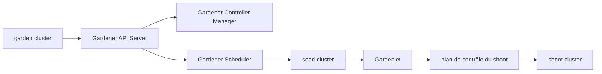

# gardener/gardener

> Gestion automatisée de clusters Kubernetes comme service, pour opérateurs d'infrastructure multi-cloud.

## Le problème
Gérer des dizaines de clusters Kubernetes sur plusieurs clouds donne des clusters hétérogènes.
Les opérations « jour 2 » (mise à jour, robustesse) sont réécrites pour chaque fournisseur.

## Ce que ça fait vraiment
Un API server d'extension plus des contrôleurs, installés dans un cluster **garden**.
Les clusters utilisateurs (**shoot**) sont décrits de façon déclarative et réconciliés en continu.
Leurs plans de contrôle (etcd, API server, controller manager, scheduler) tournent comme charge
Kubernetes native dans des clusters **seed** : pas de VM master dédiée (« kubeception »).
Certifié conformance CNCF jusqu'à Kubernetes v1.35, résultats publiés en continu sur le testgrid.

## Comment c'est branché

## Essayer
Aucune commande documentée dans le README : il renvoie à l'index de `/docs` et au guide de
mise en place d'un « landscape » Gardener.

## Coût et pièges
Gratuit côté logiciel, mais le coût réel est l'infrastructure : un cluster garden, des seeds,
et un compte chez chaque fournisseur cloud visé. Pas de chemin d'essai local dans le README.

## Ce que ce n'est pas
Ce n'est pas la Cluster API de SIG Cluster Lifecycle : Gardener harmonise aussi la composition
des clusters, pas seulement la façon d'y arriver. Ce n'est pas un outil pour un cluster unique.
Le README ne nomme ni l'entreprise qui porte le projet ni la licence.

## Alternatives
La Cluster API de SIG Cluster Lifecycle, citée comme approche voisine ; GKE, cité comme service managé.

## Pour toi
Hors périmètre d'un profil data/IA sauf si tu opères une flotte de clusters : à connaître, pas à installer.
