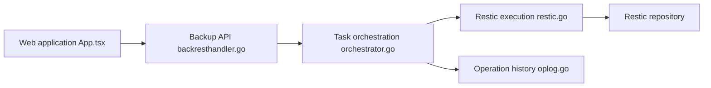

# garethgeorge/backrest

> Interface web pour restic : planifier des sauvegardes, parcourir les snapshots et restaurer.

## Le problème
restic est fiable mais en ligne de commande ; planifier, surveiller et restaurer demande du scripting.

## Ce que ça fait vraiment
Un binaire Go sert une WebUI (port 9898) qui pilote restic : création de dépôts, plans cron de backup et de maintenance (prune, check, forget), hooks pré/post, notifications (Discord, Slack, Gotify, Healthchecks…). Supporte tous les backends restic et rclone. Télécharge restic au premier lancement.

## Comment c'est branché


## Essayer
```bash
curl -fsSL https://raw.githubusercontent.com/garethgeorge/backrest/main/install.sh | bash
```
Puis ouvrir `http://localhost:9898`.

## Coût et pièges
Gratuit ; stockage de sauvegarde à ta charge. Ouvrir `BACKREST_PORT` à toutes les interfaces expose l'UI. Relire `install.sh` avant de le piper dans un shell.

## Ce que ce n'est pas
Pas un moteur de sauvegarde : il enrobe restic. 365 issues ouvertes.

## Alternatives
Aucune alternative nommée dans le README (restic en direct).

## Pour toi
À surveiller : pratique pour sauvegarder un homelab ou un NAS de données, sans enjeu data/IA direct.

