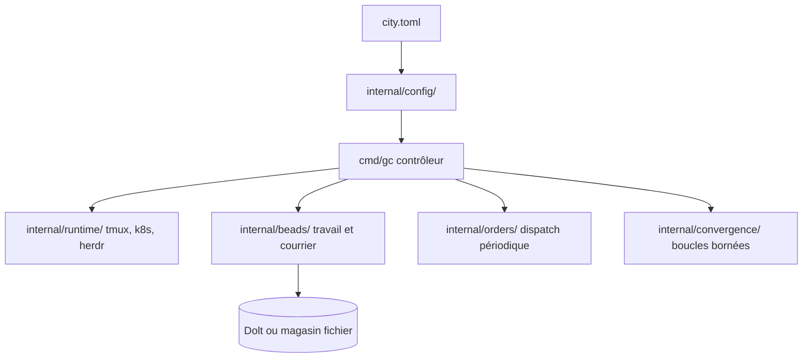

# gastownhall/gascity

> Boîte à outils déclarative pour orchestrer plusieurs agents de codage sur un ou plusieurs dépôts.

## Le problème
Faire travailler plusieurs agents ensemble demande de bricoler sessions, suivi des tâches et boucles de supervision à la main.
Rien ne réconcilie l'état voulu avec ce qui tourne réellement.

## Ce que ça fait vraiment
La ville se décrit dans un `city.toml` : agents, rigs, packs, surcharges, le tout composé et validé par `internal/config/`.
Six fournisseurs d'exécution au choix : tmux, sous-processus, exec, ACP, Kubernetes et herdr — tmux restant le repli obligatoire.
Le suivi du travail passe par « beads » (travail, courrier, convois) avec deux implémentations : `bd` adossé à Dolt par défaut, ou un magasin fichier via `GC_BEADS=file`.
Une boucle contrôleur/superviseur réconcilie l'état désiré et l'état courant ; `internal/convergence/` gère des boucles de raffinement bornées.

## Comment c'est branché


## Essayer
```bash
brew install gascity
gc version
gc init ~/bright-lights
cd ~/bright-lights
gc start
gc rig add .
bd create "Create a script that prints hello world"
gc session attach mayor
```

## Coût et pièges
La liste de prérequis est longue : tmux, git, jq, pgrep, lsof toujours ; dolt 2.1.0+, bd et flock si le fournisseur beads est `bd`.
Compiler depuis les sources demande Go 1.26.4+ et ICU ; sur NixOS ou Flox il faut pointer les trois variables `CGO_*` à la main.
Les Dolt antérieurs à 1.86.2 peuvent bloquer `dolt_backup sync` sous forte charge d'écriture.

## Ce que ce n'est pas
Pas Gas Town : c'est l'infrastructure réutilisable extraite de Gas Town, avec un modèle par primitives qu'on ne porte pas littéralement.
Pas un agent : il faut fournir `claude`, `codex` ou `gemini` selon le fournisseur retenu.
Pas une installation sans surprise : le README consacre une section entière aux chemins CGO cassés.

## Alternatives
- Gas Town : le projet amont, si tu veux l'architecture complète plutôt que les primitives.

## Pour toi
Intéressant si tu veux vraiment faire tourner plusieurs agents en parallèle ; le coût d'installation est élevé pour un usage occasionnel.
