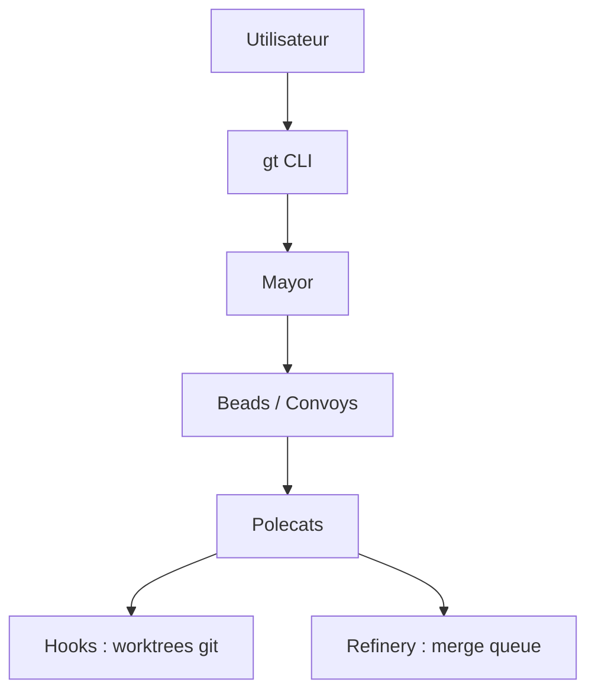

# gastownhall/gastown

> Orchestrateur de plusieurs agents de code (Claude Code, Copilot, Codex, Gemini) avec état persistant dans git.

## Le problème
Au-delà de quelques agents, le contexte se perd à chaque redémarrage et la coordination manuelle devient chaotique.

## Ce que ça fait vraiment
Un « Mayor » (agent coordinateur) découpe le travail en tickets (« beads » du ledger Beads), les regroupe en convoys et les distribue à des « polecats » (agents éphémères à identité persistante). L'état vit dans des worktrees git (« hooks »). Une file de fusion (Refinery) de type Bors valide puis fusionne ; Witness, Deacon et Dogs surveillent la santé, un planificateur limite la concurrence pour éviter les quotas d'API. Tableau de bord web, TUI `gt feed`, télémétrie OpenTelemetry optionnelle, réseau fédéré Wasteland via DoltHub.

## Comment c'est branché


## Essayer
```bash
brew install gastown
gt install ~/gt --shell --git
cd ~/gt
gt up
gt doctor --fix
gt mayor attach
```

## Coût et pièges
Nécessite Git 2.20+, Go, Beads (`bd`), Dolt, tmux et un CLI d'agent avec abonnement ou clé ; la consommation de jetons peut grimper avec 20 à 30 agents. Le tableau de bord doit rester sur réseau local de confiance.

## Ce que ce n'est pas
Ce n'est pas un agent : il coordonne des agents tiers. Le vocabulaire (Mayor, Deacon, Seance…) est maison et demande un glossaire.

## Alternatives
Le README n'en nomme aucune.

## Pour toi
À surveiller : intéressant pour comprendre l'orchestration multi-agents persistante, mais complexe et coûteux en jetons pour un usage quotidien.

