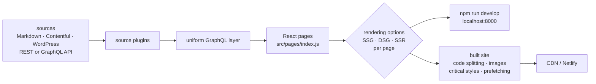

# gatsbyjs/gatsby

> **React site generator that aggregates data sources behind GraphQL and renders page by page.**

## The problem

A content site draws its material from heterogeneous places — Markdown files, a headless CMS
such as Contentful or WordPress, a REST or GraphQL API — and each source brings its own client,
format and pagination. Without an aggregation layer you write as much fetching code as you have
back-ends, and rendering work (code splitting, images, critical styles, prefetching) is redone
by hand on every project.

## What it actually does

Gatsby is a React-based framework. The README claims three things the project does itself, as
opposed to what it delegates.

First, aggregation: *source plugins* load data from any origin and expose it behind a single
GraphQL interface, which pages query without knowing the back-end.

Second, a rendering choice made **per page**: static site generation (SSG), deferred static
generation (DSG) or server-side rendering (SSR), selectable page by page — the README points to
the "rendering options" documentation for details.

Third, a set of optimisations applied by default, which the README lists: code splitting, image
optimisation, inlined critical styles, lazy loading, resource prefetching. The resulting sites
remain full React applications, not frozen pages.

The repository itself is a monorepo managed with Lerna: many packages live in it and are
published separately to npm, `gatsby` among them.

## How it is wired



No code-derived diagram exists for this repository: this one is rebuilt from the README alone.
The only file names the README cites are `src/pages/index.js`, the entry point you edit when
starting out, and the monorepo's `packages/` directory; the other nodes match steps described in
prose, not named files.

## Trying it

```shell
npm init gatsby
```

Then, having named the project "My Gatsby Site":

```shell
cd my-gatsby-site/
npm run develop
```

The site then runs at `http://localhost:8000`; you open the `my-gatsby-site` directory in your
editor and edit `src/pages/index.js`, and the browser updates. The README also offers a "Deploy
to Netlify" button based on the `gatsby-starter-blog` repository, which creates a hosted site
and a linked repository at once, redeployed on every push.

## Cost and pitfalls

- **Node and npm are required**: everything goes through `npm init` and `npm run`. No minimum
  version is stated in the README.
- **The repository is not the documentation.** The tutorial, guides, reference, plugin
  directory, starters and showcase all live on `gatsbyjs.com`, a service outside the repository.
  Past the four start-up commands, the README consistently points there: hence the
  "depends on a SaaS" flag. The code is MIT-licensed, the learning path depends on a domain you
  do not control.
- **Hosting is cheap but not free of constraints**: the README states a Gatsby site needs no
  server and fits on a CDN, and that many sites are hosted for free on Netlify or equivalents.
  Server-side rendering and deferred generation, however, assume a platform able to run them —
  the README does not say which.
- **Frequent major migrations**: the README lists v2→v3, v3→v4 and v4→v5 guides and points to a
  "version support" page to know which version is still maintained. An old site does not upgrade
  itself.
- **Monorepo**: contributing means bringing up a set of Lerna packages, not a single project.

## What it is not

- **It is not a CMS.** Gatsby reads data, it neither stores nor edits it: content stays in
  Markdown files or in a headless CMS installed alongside.
- **It is not a plain static page generator.** The README insists the sites are full React
  applications, and since the DSG and SSR options exist, not everything is necessarily built
  ahead of time — so "no servers" only holds for the purely static part.
- **It is not a host.** Netlify is cited as an example, not as a component: deployment, domain
  and bill are on the user.
- **It is not independent of React and GraphQL**: the README says every Gatsby site is built
  with both, whatever the data source. The entry cost is that of two technologies, not one.

## Alternatives

| | When to prefer it |
|---|---|
| **vercel/next.js** | A catalogue neighbour, the other React framework with mixed rendering. Prefer it when server rendering and API routes are the normal mode and you do not want a GraphQL mediation layer. Prefer Gatsby when the site aggregates several heterogeneous content sources. |
| **evanw/esbuild** | A catalogue neighbour, but not a site framework: it is a bundler. It replaces an internal brick, not Gatsby. |
| **prettier/prettier** and **vxcontrol/pentagi** | The two remaining neighbours are not comparable: a code formatter and a penetration-testing tool, placed near Gatsby by shared JavaScript vocabulary rather than by use. |

## For you

Little direct value for data or MLOps work: this is a front-end tool. The plausible use is
peripheral — publishing documentation, a technical blog or a project showcase from Markdown and
an API, with image optimisation and code splitting you do not tune yourself. Worth watching
rather than adopting: the framework is mature and very widely deployed, but it imposes React,
GraphQL, a cycle of major migrations and documentation entirely outside the repository. For a
simple documentation site the investment is out of proportion.
