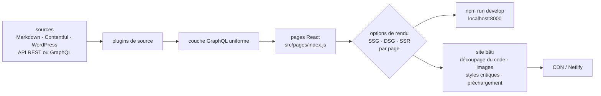

# gatsbyjs/gatsby

> **Générateur de sites React qui agrège des sources de données derrière GraphQL et rend page par page.**

## Le problème

Un site de contenu tire sa matière d'endroits hétérogènes — fichiers Markdown, CMS sans tête
type Contentful ou WordPress, API REST ou GraphQL — et chaque source impose son client, son
format et sa pagination. Sans couche d'agrégation, on écrit autant de code de récupération que
de back-ends, et l'optimisation du rendu (découpage du code, images, styles critiques,
préchargement) se refait à la main à chaque projet.

## Ce que ça fait vraiment

Gatsby est un cadre de travail fondé sur React. Le README annonce trois choses que le projet
fait lui-même, par opposition à ce qu'il délègue.

Premièrement, l'agrégation : des *plugins de source* chargent les données de n'importe quelle
origine et les exposent derrière une seule interface GraphQL, que la page interroge sans
connaître le back-end.

Deuxièmement, le choix du rendu **page par page** : génération statique (SSG), génération
statique différée (DSG) ou rendu côté serveur (SSR), sélectionnables individuellement selon la
page — le README renvoie à la documentation « rendering options » pour le détail.

Troisièmement, une série d'optimisations appliquées par défaut, que le README énumère :
découpage du code, optimisation des images, styles critiques mis en ligne, chargement différé,
préchargement des ressources. Les sites produits restent des applications React complètes, pas
des pages figées.

Le dépôt lui-même est un monorepo géré avec Lerna : de nombreux paquets y cohabitent et sont
publiés séparément sur npm, dont `gatsby`.

## Comment c'est branché



Aucun diagramme tiré du code n'existe pour ce dépôt : ce schéma est reconstruit depuis le seul
README. Les seuls noms de fichiers que le README cite sont `src/pages/index.js`, le point
d'entrée qu'on édite au démarrage, et le répertoire `packages/` du monorepo ; le reste des
nœuds correspond à des étapes décrites en prose, pas à des fichiers nommés.

## Essayer

```shell
npm init gatsby
```

Puis, en donnant au projet le nom « My Gatsby Site » :

```shell
cd my-gatsby-site/
npm run develop
```

Le site tourne alors sur `http://localhost:8000` ; on ouvre le répertoire `my-gatsby-site` dans
son éditeur et on modifie `src/pages/index.js`, le navigateur se met à jour. Le README propose
aussi un bouton « Deploy to Netlify » à partir du dépôt `gatsby-starter-blog`, qui crée d'un
coup un site hébergé et un dépôt lié, redéployé à chaque poussée.

## Coût et pièges

- **Node et npm sont requis** : tout passe par `npm init` et `npm run`. Aucune version minimale
  n'est donnée dans le README.
- **Le dépôt n'est pas la documentation.** Le tutoriel, les guides, la référence, l'annuaire de
  plugins, les starters et le showcase vivent tous sur `gatsbyjs.com`, un service extérieur au
  dépôt. Passé les quatre commandes du démarrage, le README renvoie systématiquement à ce site :
  c'est la raison de l'alerte `dépend d'un SaaS`. Le code est sous licence MIT, l'apprentissage
  dépend d'un domaine qu'on ne contrôle pas.
- **L'hébergement est bon marché mais pas nul** : le README affirme qu'un site Gatsby ne
  nécessite pas de serveur et tient sur un CDN, et que beaucoup tiennent gratuitement sur
  Netlify ou équivalent. Le rendu côté serveur (SSR) et la génération différée (DSG), eux,
  supposent une plateforme capable de les exécuter — le README ne dit pas laquelle.
- **Migrations majeures fréquentes** : le README liste des guides v2→v3, v3→v4 et v4→v5, et
  renvoie à une page « version support » pour savoir quelle version est encore suivie. Un site
  ancien ne se met pas à jour tout seul.
- **Monorepo** : contribuer suppose de mettre en route un ensemble de paquets Lerna, pas un
  seul projet.

## Ce que ce n'est pas

- **Ce n'est pas un CMS.** Gatsby lit les données, il ne les stocke ni ne les édite : le contenu
  reste dans des fichiers Markdown ou dans un CMS sans tête installé à côté.
- **Ce n'est pas un simple générateur de pages statiques.** Le README insiste : les sites sont
  des applications React complètes, et depuis les options DSG et SSR, tout n'est pas
  nécessairement bâti à l'avance — donc « pas de serveur » n'est vrai que pour la partie
  purement statique.
- **Ce n'est pas un hébergeur.** Netlify est cité comme exemple, pas comme composant : le
  déploiement, le domaine et la facture sont à la charge de l'utilisateur.
- **Ce n'est pas indépendant de React et de GraphQL** : le README dit que tout site Gatsby est
  bâti avec les deux, quelle que soit l'origine des données. Le coût d'entrée est donc celui de
  deux technologies, pas d'une.

## Alternatives

| | Quand le préférer |
|---|---|
| **vercel/next.js** | Voisin du catalogue, l'autre cadre React de rendu mixte. À préférer quand on veut du rendu serveur et des routes d'API comme mode normal, sans passer par une couche GraphQL de médiation. Gatsby à préférer quand le site agrège plusieurs sources de contenu hétérogènes. |
| **evanw/esbuild** | Voisin du catalogue, mais ce n'est pas un cadre de site : c'est un empaqueteur. Il remplace une brique interne, pas Gatsby. |
| **prettier/prettier** et **vxcontrol/pentagi** | Les deux autres voisins ne sont pas comparables : un formateur de code et un outil de test d'intrusion, rapprochés de Gatsby par le lexique JavaScript et non par l'usage. |

## Pour toi

Peu d'intérêt direct pour un travail data ou MLOps : c'est un outil de front-end. L'usage
plausible est périphérique — publier une documentation, un blog technique ou une vitrine de
projets à partir de Markdown et d'une API, avec optimisation d'images et découpage de code sans
les régler soi-même. À surveiller plutôt qu'à adopter : le cadre est mûr et très largement
déployé, mais il impose React, GraphQL, un cycle de migrations majeures et une documentation
entièrement hors dépôt. Pour un site de documentation simple, l'investissement est
disproportionné.
