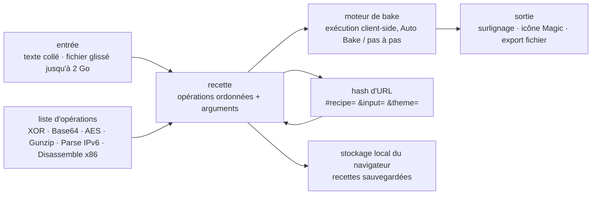

# gchq/CyberChef

> **In-browser data manipulation workbench for analysts, technical or not.**

## The problem

Decoding a string, decrypting it, decompressing it and then reading it back as a hexdump means
four different command-line tools today, each with its own syntax and manual copy-pasting in
between. Send the data through an online service and it also leaves the machine, which is not a
detail when the sample is suspicious. And a non-developer analyst is stuck at step one.

## What it actually does

CyberChef is a web app that chains "operations" over an input. The README describes four areas:
the **input** box (paste, type, or drag a file), the **output** box, the **operations** list
grouped into searchable categories, and the **recipe** in the middle, where operations are
dragged in the chosen order with their arguments.

Per the README, the operation catalogue covers simple encodings (XOR, Base64), encryption (AES,
DES, Blowfish), binary and hexdumps, compression and decompression, hashes and checksums, IPv6
and X.509 parsing, and character-encoding conversion. The linked examples go as far as x86
disassembly after RC4 decryption.

Around the recipe, the README lists: *Auto Bake*, which recomputes the output on every change
(switchable off for large inputs), breakpoints and step-by-step execution to inspect data
between two operations, the `Magic` operation that tries to detect stacked encodings
automatically, recipe saving into browser local storage, cross-highlighting between input and
output with offset and length, drag-and-drop loading of files up to 2GB, and saving the output
to a file.

The structural point: **all processing happens in the browser**. The README states that neither
the recipe nor the input is ever sent to the server, and that the whole app can be downloaded to
be dropped into a virtual machine or a closed network.

## How it is wired



No code-derived diagram exists for this repository: this one is reconstructed from the README
alone. What it shows is that there is **no server** in the chain: the full state (recipe plus
input) fits in the URL hash, which is why sharing a link is enough to share a reproducible
processing pipeline.

## Try it

Pre-built image, no toolchain:

```bash
docker run -it -p 8080:8080 ghcr.io/gchq/cyberchef:latest
```

Then open `http://localhost:8080`. To build the image yourself:

```bash
docker build --tag cyberchef --ulimit nofile=10000 .
docker run -it -p 8080:8080 cyberchef
```

From source, with Node.js `v24`:

```bash
git clone https://github.com/gchq/CyberChef.git
cd CyberChef
npm install
```

Common tasks listed by the README: `npm start` (dev server with live reload at
`http://localhost:8080`), `npm run build` (production build in `build/prod`), `npm test`,
`npm run testui`, `npm run lint`, `npm run newop` (interactive script scaffolding a new
operation). On out-of-memory errors while building large recipes: `npm run setheapsize`.

## Cost and traps

- **Free, no account, no key.** Apache 2.0, plus UK Crown Copyright. Nothing to pay, nothing to
  sign up for: the README mentions no quota and no crippled free tier.
- **Narrow Node.js window**: the README requires Node.js `v24`, additionally tested against
  `v26`. The repo ships an `.nvmrc` and recommends `nvm` precisely to avoid clashing with other
  projects on the machine. Outside that window, the build is not covered.
- **The build can run out of memory** — the README documents `npm run setheapsize` for large
  recipes, which says enough about how light the compilation is not.
- **Single-author origin**: the README states the tool was "conceived, designed, built and
  incrementally improved by an analyst in their 10% innovation time over several years". It is an
  organisation project today (GCHQ), but that original concentration is the only alert defensible
  from the README — check the repository's actual activity.
- **The real cost is the workstation**: the advertised 2GB file limit is "depending on your
  browser", and the README warns some operations may take "a very long time" over that much data.
  Auto Bake should be switched off in that case.
- **Supported browsers**: Chrome 50+ and Firefox 38+ only, per the README. Nothing is stated for
  Safari or mobile browsers.
- **Contributing has an administrative prerequisite**: a first pull request triggers the *GCHQ
  Contributor Licence Agreement*, along with a question about being contacted by GCHQ.

## What it is not

- **It is not an online service that processes your data.** Exactly the opposite: the README
  insists nothing is sent to the server. The official website is only static file hosting; the app
  can be taken offline. The flip side is symmetric — the browser does all the computing, so there
  is no server-side batch processing.
- **It is not a command-line tool.** A Node API exists (deferred to the wiki, outside the README),
  but the product described here is a drag-and-drop graphical interface. It is not the brick you
  put in an automated pipeline.
- **It is not a malware analysis tool or a sandbox.** It disassembles and decrypts what you hand
  it; it runs nothing, judges nothing, detects no threat. `Magic` guesses encodings, not
  intentions.
- **It is not storage.** Saved recipes live in the browser's local storage; clearing the browser
  erases them. Sharing goes through a URL that embeds the input in Base64 — so sensitive data
  pasted into a link travels with the link.

## Alternatives

No comparable alternative in the catalogue: the README names no competing tool, and the
lexicon-derived neighbours belong to other trades — `anchore/grype` scans images for
vulnerabilities, `bridgecrewio/checkov` analyses infrastructure-as-code, `argoproj/argo-cd` does
Kubernetes continuous delivery, `marimo-team/marimo` is a reactive Python notebook. None offers a
chain of data-transformation operations inside the browser.

## For you

Worth adopting, and above all worth running locally once and for all: `docker run
ghcr.io/gchq/cyberchef` takes thirty seconds and replaces half the throwaway decoding scripts one
rewrites every month. For a data / AI profile it is the exploration tool to reach for when facing
a sample of unknown encoding, a compressed blob or an encrypted field — and the fact that the data
never leaves the workstation settles the recurring question of whether you are allowed to paste
that excerpt into an online decoder. Not the right choice if the need is to automate a recurring
transformation: it is a manual interface, not a pipeline component.
