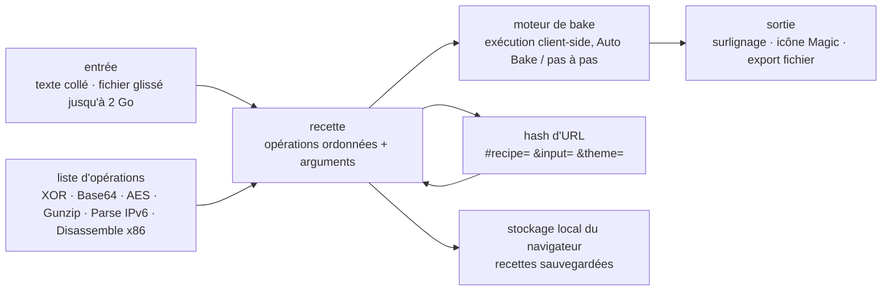

# gchq/CyberChef

> **Atelier de manipulation de données dans le navigateur, pour analystes techniques ou non.**

## Le problème

Décoder une chaîne, la déchiffrer, la décompresser puis la relire en hexdump, c'est aujourd'hui
quatre outils en ligne de commande différents, chacun avec sa syntaxe, et un collage manuel
entre chaque étape. Quand la donnée passe par un service en ligne, elle sort en plus de la
machine — ce qui n'est pas neutre sur un échantillon suspect. Et un analyste non développeur
reste bloqué dès la première étape.

## Ce que ça fait vraiment

CyberChef est une application web qui enchaîne des « opérations » sur une donnée d'entrée. Le
README décrit quatre zones : la boîte d'**entrée** (coller, taper ou glisser un fichier), la
boîte de **sortie**, la liste des **opérations** rangées par catégories et cherchables, et la
**recette** au milieu, où l'on glisse les opérations dans l'ordre voulu avec leurs arguments.

Le catalogue d'opérations couvre, d'après le README : encodages simples (XOR, Base64),
chiffrement (AES, DES, Blowfish), binaire et hexdump, compression et décompression, hachages et
sommes de contrôle, analyse d'adresses IPv6 et de certificats X.509, changements de jeux de
caractères. Les exemples liés vont jusqu'au désassemblage x86 après déchiffrement RC4.

Autour de la recette, le README annonce : l'*Auto Bake* qui recalcule la sortie à chaque
modification (désactivable si l'entrée est volumineuse), des points d'arrêt et l'exécution pas à
pas pour inspecter la donnée entre deux opérations, l'opération `Magic` qui tente de détecter
automatiquement les encodages empilés, la sauvegarde de recettes dans le stockage local du
navigateur, le surlignage croisé entrée/sortie avec offset et longueur, le chargement de
fichiers jusqu'à 2 Go par glisser-déposer, et l'export de la sortie en fichier.

Point structurant : **tout le traitement se fait dans le navigateur**. Le README précise que ni
la recette ni l'entrée ne sont envoyées au serveur, et que l'application entière se télécharge
pour être posée dans une machine virtuelle ou un réseau fermé.

## Comment c'est branché



Aucun diagramme tiré du code n'existe pour ce dépôt : ce schéma est reconstruit depuis le seul
README. Ce qu'il montre, c'est qu'il n'y a **pas de serveur** dans la chaîne : l'état complet
(recette + entrée) tient dans le hash d'URL, ce qui explique que partager un lien suffise à
partager un traitement reproductible.

## Essayer

Image pré-construite, sans chaîne de compilation :

```bash
docker run -it -p 8080:8080 ghcr.io/gchq/cyberchef:latest
```

Puis `http://localhost:8080` dans le navigateur. Pour construire l'image soi-même :

```bash
docker build --tag cyberchef --ulimit nofile=10000 .
docker run -it -p 8080:8080 cyberchef
```

Depuis les sources, avec Node.js `v24` :

```bash
git clone https://github.com/gchq/CyberChef.git
cd CyberChef
npm install
```

Les tâches courantes listées par le README : `npm start` (serveur de développement avec
rechargement à chaud sur `http://localhost:8080`), `npm run build` (build de production dans
`build/prod`), `npm test`, `npm run testui`, `npm run lint`, `npm run newop` (script interactif
de création d'une nouvelle opération). En cas d'erreur mémoire au build de grosses recettes :
`npm run setheapsize`.

## Coût et pièges

- **Gratuit, sans compte, sans clé.** Apache 2.0, plus Crown Copyright côté britannique. Rien à
  payer, rien à s'inscrire : le README ne mentionne aucun quota ni version bridée.
- **Fenêtre Node.js étroite** : le README exige Node.js `v24`, testé en plus contre `v26`. Le
  dépôt fournit un `.nvmrc` et recommande `nvm` justement pour éviter le conflit avec les autres
  projets de la machine. Hors de cette fenêtre, le build n'est pas couvert.
- **Le build peut manquer de mémoire** — le README documente `npm run setheapsize` pour les
  grosses recettes, ce qui dit assez que la compilation n'est pas légère.
- **Origine d'un seul auteur** : le README écrit que l'outil a été « conçu, dessiné, construit et
  amélioré progressivement par un analyste sur son temps d'innovation à 10 %, pendant plusieurs
  années ». C'est aujourd'hui un projet d'organisation (GCHQ), mais la concentration d'origine
  est la seule alerte défendable au vu du README — à vérifier sur l'activité réelle du dépôt.
- **Le coût réel est la machine du poste** : les 2 Go de fichier annoncés sont « selon le
  navigateur », et le README prévient que certaines opérations peuvent être « très longues » sur
  de tels volumes. Auto Bake est à couper dans ce cas.
- **Navigateurs supportés** : Chrome 50+ et Firefox 38+ seulement d'après le README. Rien n'est
  annoncé pour Safari ou les navigateurs mobiles.
- **Contribuer a un préalable administratif** : la première pull request déclenche la signature
  du *GCHQ Contributor Licence Agreement*, avec au passage une question sur l'accord à être
  recontacté par GCHQ.

## Ce que ce n'est pas

- **Ce n'est pas un service en ligne qui traite tes données.** L'inverse exactement : le README
  insiste sur le fait que rien n'est envoyé au serveur. Le site officiel n'est qu'un hébergement
  de fichiers statiques ; on peut l'emporter hors ligne. Mais la conséquence est symétrique — le
  navigateur fait tout le calcul, donc pas de traitement par lots côté serveur.
- **Ce n'est pas un outil en ligne de commande.** Une API Node existe (renvoyée au wiki, hors
  README), mais le produit décrit ici est une interface graphique à glisser-déposer. Ce n'est pas
  la brique qu'on met dans un pipeline automatisé.
- **Ce n'est pas un outil d'analyse de malware ni un bac à sable.** Il désassemble et déchiffre
  ce qu'on lui donne ; il n'exécute rien, ne juge rien, ne détecte pas de menace. `Magic` devine
  des encodages, pas des intentions.
- **Ce n'est pas un stockage.** Les recettes sauvegardées vivent dans le stockage local du
  navigateur ; vider le navigateur les efface. Le partage passe par une URL, qui contient l'entrée
  en Base64 — donc une donnée sensible collée dans un lien voyage avec le lien.

## Alternatives

Aucune alternative comparable dans le catalogue : le README ne nomme aucun outil concurrent, et
les voisins proposés par le lexique traitent d'autres métiers — `anchore/grype` scanne des
vulnérabilités dans des images, `bridgecrewio/checkov` analyse de l'infrastructure-as-code,
`argoproj/argo-cd` fait du déploiement continu Kubernetes, `marimo-team/marimo` est un carnet
Python réactif. Aucun ne propose de chaîne d'opérations de transformation de données dans le
navigateur.

## Pour toi

À adopter, et surtout à faire tourner en local une bonne fois : `docker run ghcr.io/gchq/cyberchef`
prend trente secondes et remplace la moitié des scripts jetables de décodage qu'on réécrit chaque
mois. Pour un profil data / IA, c'est l'outil d'exploration à dégainer devant un échantillon dont
on ignore l'encodage, un blob compressé ou un champ chiffré — et le fait que la donnée ne sorte
pas du poste règle la question, fréquente, de savoir si on a le droit de coller cet extrait dans
un décodeur en ligne. À ne pas choisir si le besoin est d'automatiser une transformation
récurrente : c'est une interface manuelle, pas une brique de pipeline.
