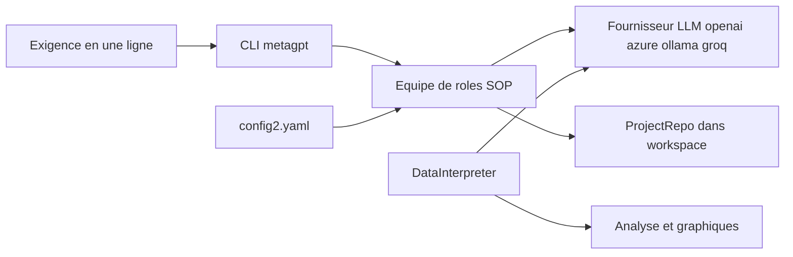

# geekan/MetaGPT

> **A Python framework that makes several LLM roles collaborate on one software request.**

## The problem

Getting an LLM to produce more than an isolated file means replaying the chain "requirement →
spec → architecture → code" by hand. Without a frame, every rerun starts from scratch and
nothing ties the initial request to the artefacts produced.

## What it actually does

MetaGPT takes a one-line requirement and outputs, per the README, user stories, competitive
analysis, requirements, data structures, APIs and documents. Internally it instantiates roles
— product manager, architect, project manager, engineer — and applies orchestrated SOPs to
them; the stated philosophy is `Code = SOP(Team)`. The CLI `metagpt "Create a 2048 game"`
writes a repo into `./workspace`. As a library, `generate_repo()` returns a `ProjectRepo`.
A separate role, `DataInterpreter`, writes and runs analysis code (README example: the sklearn
Iris dataset with a plot). The README does not document any quality guarantee on generated code.

## How it is wired



The entry point is either the CLI or `metagpt.software_company.generate_repo`. Configuration
lives in `~/.metagpt/config2.yaml`, created by `metagpt --init-config`, and names the LLM
provider (`api_type`, `model`, `base_url`, `api_key`). The output is a materialised repo,
described on the Python side by `metagpt.utils.project_repo.ProjectRepo`. The
`DataInterpreter` (`metagpt.roles.di.data_interpreter`) is a distinct, async usage path that
writes and executes code instead of producing a repo.

## Trying it

```bash
python --version   # 3.9 or later, but less than 3.12
conda create -n metagpt python=3.9 && conda activate metagpt
pip install --upgrade metagpt
metagpt --init-config   # creates ~/.metagpt/config2.yaml
metagpt "Create a 2048 game"  # this will create a repo in ./workspace
```

The README also requires node and pnpm to be installed before actual use. A no-install demo
exists on the Hugging Face Space `deepwisdom/MetaGPT-SoftwareCompany`.

## Cost and traps

Python 3.9 to 3.11 only: the upper bound excludes 3.12. Node and pnpm are required on top of
the pip package. You need an LLM provider API key, at your own cost: the sample config points
at `gpt-4-turbo` on OpenAI, and billing scales with the number of roles and turns, which the
README does not quantify. Other `api_type` values are listed (azure, ollama, groq), so a local
model is possible, but the README documents neither the resulting quality nor the consumption
in that case. The publisher also promotes a separate commercial product, MGX (mgx.dev), worth
keeping in mind regarding the open-source project's trajectory.

## What it is not

It is not a dependable turnkey application generator: nothing in the README promises the
produced repo compiles, passes tests or stays maintainable. It is not a model or an inference
provider either — you bring your own LLM. And it is not MGX: the hosted product announced in
2025 is distinct from the package installed here.

## Alternatives

No competitor is named in the README; the comparisons come from catalogue neighbours.
`Significant-Gravitas/AutoGPT` targets the general autonomous agent, where MetaGPT imposes
software-company roles and SOPs. `langchain-ai/langchain` is a lower-level toolkit: prefer it
if you want to wire the agent graph yourself. `langflow-ai/langflow` offers visual assembly of
such chains rather than a ready-made team.

## For you

Mostly interesting for `DataInterpreter`, a data-analysis agent runnable in a few lines, and
as a reference implementation of SOP-driven multi-agent orchestration. For repo generation in
production, watch rather than adopt: the licence is undeclared in the catalogue (the README
shows an MIT badge) and the publisher's centre of gravity has moved to its hosted offering.
